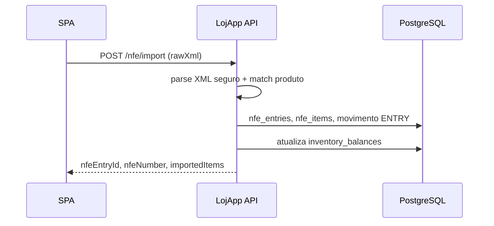

# LojApp — Plataforma de Gestão Comercial

[](https://openjdk.org/)
[](https://spring.io/projects/spring-boot)
[](https://react.dev/)
[](docs/docker-wsl-ubuntu.md)
[](LICENSE)

SPA React + API Spring Boot para **gestão de loja física**: produtos, stock, vendas, importação de **NFe (XML)**, **PDV/caixa**, dashboard com KPIs, gráficos e **curva ABC**.

---

## Visão geral

| | |
|---|---|
| **Problema** | Sair da planilha frágil sem cair num ERP pesado |
| **Solução** | Fluxo MVP real — nota entra, stock atualiza, venda baixa saldo, indicadores apoiam compra e precificação |
| **Isolamento** | Dados isolados por conta (multi-loja: uma conta = uma loja) |
| **Diferenciais** | JWT + refresh com rotação, rate limit, Actuator/Prometheus, auditoria, OpenAPI, TanStack Query, skeletons no dashboard |

---

## Screenshots

> Adicione capturas reais em [`docs/screenshots/`](docs/screenshots/) para dar credibilidade imediata ao portfólio.

| Arquivo | Tela |
|---------|------|
| `01-login.png` | Login / registro |
| `02-dashboard.png` | Dashboard (KPIs + gráficos) |
| `03-vendas.png` | Histórico de vendas |
| `04-estoque.png` | Stock / inventário |
| `05-importacao-xml.png` | Importação NFe (XML) |
| `06-relatorios.png` | Relatórios (curva ABC / marcas) |

<!--


-->

Inclua também um GIF curto (`10–20 s`) do fluxo principal em `docs/screenshots/07-fluxo-principal.gif`:

```md

```

Guia de captura: [`docs/screenshots/README.md`](docs/screenshots/README.md).

---

## Stack

| Camada | Tecnologia |
|--------|------------|
| API | Java 21, Spring Boot 3.5, JPA, Flyway, PostgreSQL 16 |
| Segurança | JWT (access + refresh opaco com rotação), Bucket4j (rate limit), `@PreAuthorize` por role |
| Documentação | springdoc-openapi / Swagger (desativável em `prod`) |
| Observabilidade | Spring Actuator (`health`, `info`, `metrics`, `prometheus`), correlation id via `X-Request-Id` / MDC |
| Frontend | React 19, Vite 6, TypeScript, TanStack Query, Zustand, Recharts, Sonner |
| Testes | JUnit 5, Mockito, H2 (testes leves), Testcontainers + Postgres (integração) |

### Roles (`AppRole`)

| Role | Uso típico |
|------|------------|
| `USER` | Operador da loja (catálogo, vendas, NFe, dashboard) |
| `ADMIN` | Administração (`GET /users/admin/list`, etc.) |
| `REPRESENTATIVE` | Representante B2B (mesmo acesso operacional base que `USER`) |
| `CASHIER` / `SELLER` | PDV — finalização de venda |
| `MANAGER` | PDV — abertura/fecho de turno de caixa |

---

## Arquitetura

```text
[ React SPA ]  ──── JWT + refresh ────▶  [ REST /api/v1 ]
                                               │
                   ┌───────────────────────────┼──────────────────────┐
                   │                           │                      │
             AuthController           LojApp controllers        Actuator /prometheus
                   │                           │                      │
            Auth*UseCase                 application/              Métricas JVM/HTTP
                   │                    (use cases)                      │
              AuthService                  Services                      │
                   │                           │                      │
             refresh_tokens              Repositories
             audit_logs                  PostgreSQL (Flyway V1…V20)
```

**Camadas:** controllers finos → `application` (use cases) + `service` → `repository`. DTOs para contratos HTTP; entidades em `entity`. ArchUnit valida dependências entre camadas.

**Auditoria:** tabela `audit_logs` com eventos (`AUTH_LOGIN`, `SALE_CREATED`, `NFE_IMPORT`, `STOCK_ADJUST`, …).

**Dashboard:** `/dashboard/inventory-kpis`, `/dashboard/brands`, `/dashboard/products-abc` (curva ABC).

**PDV:** turnos de caixa (`/pos/cash-sessions/*`) e finalização de venda (`/pos/sales/finalize`).

### Formato de erro da API

Respostas de erro seguem `ApiErrorResponse` (tratado em `GlobalExceptionHandler`):

```json
{
  "message": "Texto legível para o utilizador ou integrador.",
  "code": "VALIDATION_ERROR",
  "status": 400,
  "path": "/api/v1/lojapp/products",
  "timestamp": "2026-04-24T12:00:00Z"
}
```

O campo `code` usa valores do enum `ApiErrorCode` (`BAD_REQUEST`, `FORBIDDEN`, `CONFLICT`, `INTERNAL_ERROR`, …). O SPA consome este formato em `frontend/src/api.ts`.

---

## Fluxo principal

1. **Auth** — registro/login devolve `accessToken` (memória do browser); refresh opaco em cookie HttpOnly (`lojapp_rt`, path `/api/v1/auth`). Ao abrir a app, renova o access a partir dessa cookie.
2. **Catálogo** — marcas, fornecedores, coleções, modelos e produtos; ajuste de stock ou entrada via importação NFe.
3. **Vendas** — registam movimento `SALE` e reduzem saldo; PDV com pagamentos e turno de caixa.
4. **Dashboard** — faturamento/lucro por marca, top produtos, curva ABC (80/15/5 %) e alertas de stock baixo.

### Importação NFe → stock



---

## Portas (referência única)

| Serviço | Porta host | Onde está definido |
|---------|------------|-------------------|
| **API Spring Boot** | **8000** | `application.yml`, `docker-compose.yml`, `docker-compose.prod.yml`, `vite.config.ts` (proxy) |
| **Frontend Vite (dev)** | **3000** | `frontend/vite.config.ts` |
| **PostgreSQL** | **5432** | `docker-compose.yml` |
| **Redis** | **6379** | `docker-compose.yml` |

**Links locais (dev):**

| | URL |
|---|-----|
| Frontend | http://localhost:3000 |
| Login | http://localhost:3000/login |
| Swagger | http://localhost:8000/swagger-ui.html |
| Health | http://localhost:8000/actuator/health |

O proxy Vite encaminha `/api/*` → `http://localhost:8000`. Se a API não estiver na **8000**, o front devolve 502.

---

## Como rodar (local)

**Requisitos:** Java 21, Maven 3.9+, Node 20+, Docker (recomendado para Postgres/Redis).

Maven Wrapper na raiz: `./mvnw` (Linux/Mac) ou `.\mvnw.cmd` (Windows).

### 0. Variáveis de ambiente (obrigatório)

```bash
cp .env.example .env
```

Preencha no `.env`:

| Variável | Obrigatório | Descrição |
|----------|-------------|-----------|
| `POSTGRES_PASSWORD` | Sim (Docker) | Password do Postgres no Compose |
| `LOJAPP_JWT_SECRET` | Sim | Segredo JWT (≥ 32 caracteres) |
| `SPRING_DATASOURCE_PASSWORD` | Sim (Maven + Docker) | Mesmo valor que `POSTGRES_PASSWORD` |
| `SPRING_DATASOURCE_URL` | Recomendado | Com Postgres do Compose: `jdbc:postgresql://localhost:5432/loja_db` |
| `SPRING_DATASOURCE_USERNAME` | Recomendado | `loja_user` (Compose dev) |
| `LOJAPP_CORS_ORIGINS` | Produção | Origens do frontend |
| `VITE_API_BASE` | Build prod | URL pública da API (sem barra final) |

> **Não commite `.env`.** O repositório inclui apenas `.env.example`.

### Fluxo A — recomendado para desenvolvimento diário

Infra no Docker; API com Maven (hot reload, alinhado ao proxy Vite):

```bash
docker compose up -d db redis
./mvnw spring-boot:run          # API → http://localhost:8000
cd frontend && npm install && npm run dev   # SPA → http://localhost:3000
```

### Fluxo B — stack completa no Docker

```bash
docker compose up -d
# API → http://localhost:8000 (mesma porta que Maven e proxy Vite)
cd frontend && npm install && npm run dev
```

> **Não corra `mvn spring-boot:run` e o serviço `api` do Compose em simultâneo** — ambos usam a porta **8000** e o mesmo Postgres/Redis.

### Fluxo C — produção local (exemplo)

```bash
docker compose -f docker-compose.prod.yml up -d
# API prod → http://localhost:8000 (Swagger desligado)
```

### Docker no WSL2 / Ubuntu

Se aparecer `permission denied` ao conectar ao Docker daemon, siga [docs/docker-wsl-ubuntu.md](docs/docker-wsl-ubuntu.md).

### Executar testes

```bash
# Backend
./mvnw test

# Frontend
cd frontend
npm run lint
npm run test
npm run e2e
```

---

## Troubleshooting

### `POST /api/v1/auth/login` retorna 401

O login usa `AuthLoginUseCase` → `UserRepository.findByEmailIgnoreCase` + `PasswordEncoder.matches` em `password_hash`. 401 quase sempre = email inexistente ou senha errada.

**1. Verificar utilizador no Postgres** (Compose dev: `loja_user` / `loja_db`, contentor `loja-postgres`):

```bash
docker exec -it loja-postgres psql -U loja_user -d loja_db -c "
SELECT id, email, left(password_hash, 7) AS prefix, length(password_hash) AS tamanho
FROM users
WHERE lower(email) = lower('exemplo@email.com');
"
```

**2. Interpretar o resultado:**

| Resultado | Causa provável |
|-----------|----------------|
| 0 linhas | Utilizador inexistente — use `POST /api/v1/auth/register` (`LOJAPP_REGISTRATION_ENABLED=true` no Compose dev) |
| `prefix` `$2a$`/`$2b$`/`$2y$`, `tamanho = 60` | Hash BCrypt plausível — confira senha e email |
| Texto plano ou `tamanho ≠ 60` | Atualize com BCrypt (12 rounds) |

**3. Gerar hash BCrypt:**

```bash
docker run --rm python:3.12-alpine sh -c \
  "pip install -q bcrypt && python -c \"import bcrypt; print(bcrypt.hashpw(b'SUA_SENHA', bcrypt.gensalt(rounds=12)).decode())\""
```

**4. Porta ao testar com `curl`:** API em **http://localhost:8000** (`http://localhost:8000/api/v1/auth/login`).

**5. `curl: (56) Connection reset by peer`:** veja `docker logs loja-api --tail 80`. Causas: JDBC com host errado (use **`db`** na rede Compose), Postgres a iniciar, `LOJAPP_JWT_SECRET` ausente, erro Flyway.

### Frontend 502 em `/api`

A API não está em **http://localhost:8000**. Confirme com `curl http://localhost:8000/actuator/health`.

---

## API — Rotas principais (`/api/v1`)

| Método | Caminho | Descrição |
|--------|---------|-----------|
| `POST` | `/auth/register` | Registro → tokens |
| `POST` | `/auth/login` | Login → tokens |
| `POST` | `/auth/refresh` | Renovar par access + refresh |
| `POST` | `/auth/logout` | Terminar sessão (limpa cookie) |
| `GET` | `/users/me` | Utilizador autenticado |
| `GET` | `/lojapp/dashboard/brands` | KPI por marca (`from`, `to`) |
| `GET` | `/lojapp/dashboard/products-abc` | Curva ABC / top produtos |
| `GET` | `/lojapp/dashboard/inventory-kpis` | Totais SKUs, unidades, stock baixo |
| `GET/POST` | `/lojapp/products`, `/brands`, `/suppliers`, … | Catálogo e hierarquia |
| `POST` | `/lojapp/sales` | Registar venda |
| `POST` | `/lojapp/sales/{id}/cancel` | Cancelar venda |
| `POST` | `/lojapp/nfe/import` | Importar XML NFe |
| `POST` | `/lojapp/inventory/adjust` | Ajuste manual de stock |
| `POST` | `/lojapp/pos/sales/finalize` | Finalizar venda PDV |
| `POST/GET` | `/lojapp/pos/cash-sessions/*` | Turno de caixa (abrir/fechar) |

Documentação completa: **http://localhost:8000/swagger-ui.html** (desligado em `prod`).

**Actuator:** em dev expõe `metrics` e `prometheus`. Em `SPRING_PROFILES_ACTIVE=prod` apenas `health` e `info` por defeito. Override: `LOJAPP_MANAGEMENT_ENDPOINTS_WEB_EXPOSURE_INCLUDE`.

---

## Scripts operacionais

| Caminho | Objetivo |
|---------|----------|
| `scripts/verify-api-env.ps1` / `.sh` | Verifica variáveis antes de subir/deploy |
| `scripts/import-nfe-folder.sh` | Importa lote de XMLs NFe |
| `scripts/run-nfe-integration-tests.sh` | Bateria de testes integração NFe |
| `scripts/git-untrack-frontend-artifacts.ps1` | Remove artefatos do índice Git |
| `scripts/package-source-safe.ps1` | ZIP seguro do código-fonte |

```powershell
powershell -ExecutionPolicy Bypass -File scripts/package-source-safe.ps1 -OutputZip "C:\temp\lojapp-safe.zip"
```

---

## Git: não versionar artefatos de build

O `.gitignore` exclui `node_modules`, `dist`, `target` e `build`. Se entraram no índice:

```powershell
powershell -ExecutionPolicy Bypass -File scripts/git-untrack-frontend-artifacts.ps1
```

---

## Deploy

- **Backend:** imagem Docker (JAR + perfil `prod`), Postgres gerenciado. Defina `SPRING_PROFILES_ACTIVE=prod`, `LOJAPP_JWT_SECRET` forte, `LOJAPP_CORS_ORIGINS`.
- **Frontend:** `npm run build` em Vercel, Netlify ou CDN; `VITE_API_BASE` apontando para a API.
- **All-in-one:** Railway, Render, Fly.io ou VPS — ver `docker-compose.prod.yml`.

Guia detalhado: [`docs/lojapp/10-guia-junior-piloto-deploy-proximos-passos.md`](docs/lojapp/10-guia-junior-piloto-deploy-proximos-passos.md).

---

## Resultados do MVP

- Fluxo ponta a ponta: registro/login, catálogo, stock, venda, NFe, dashboard e PDV.
- Segurança: JWT com refresh, `@PreAuthorize`, auditoria e isolamento por `user_id`.
- Qualidade: testes unitários, ArchUnit, Testcontainers, CI (GitHub Actions).
- Schema versionado com Flyway (V1…V20).

## Próximos passos

- PWA / modo offline leve; code-split do bundle do dashboard.
- Expandir `@PreAuthorize` e políticas por role (admin multi-loja).
- Soft delete em produtos; cache (Caffeine) em leituras frequentes.
- Export CSV/PDF do dashboard; integração fiscal adicional.

---

## Documentação

- [Escopo MVP](docs/lojapp/01-escopo-mvp.md)
- [Plano piloto / implantação](docs/lojapp/03-implantacao-pilotos.md)
- [Guia deploy e próximos passos](docs/lojapp/10-guia-junior-piloto-deploy-proximos-passos.md)
- [Docker + WSL2 / Ubuntu](docs/docker-wsl-ubuntu.md)

## Licença

Distribuído sob a licença MIT — ver [`LICENSE`](LICENSE).

---

Repositório: [HelderAbud/Sistema-Loja](https://github.com/HelderAbud/Sistema-Loja)
