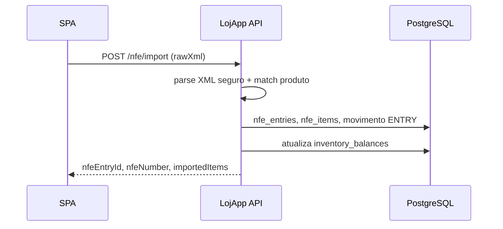

# LojApp — Loja Sistema

[](docs/docker-wsl-ubuntu.md)

**Plataforma de Gestão Comercial com Automação Fiscal** (**LojApp**: API Spring Boot + SPA React neste repositório).

## Em 15 segundos

| Pergunta | Resposta |
|----------|----------|
| **O que é?** | SPA React + API Spring Boot para **gestão de loja física**: produtos, stock, vendas, importação de **NFe (XML)** e **dashboard** com KPIs, gráficos e **curva ABC**. |
| **Que problema resolve?** | Sai da planilha frágil e do ERP pesado: um fluxo **MVP real** — nota entra, stock atualiza, venda baixa saldo, indicadores apoiam **compra e precificação**. Dados **isolados por conta** (multi-loja: uma conta = uma loja). |
| **Como rodar?** | `docker compose up -d` para stack completa + `cd frontend && npm install && npm run dev` para desenvolvimento visual — ver secção [Como rodar (local)](#como-rodar-local). |
| **Por que é especial?** | **JWT + refresh** com rotação, **rate limit**, **Actuator/Prometheus**, **auditoria**, API documentada (OpenAPI), frontend com **TanStack Query**, gráficos e **skeleton** no dashboard — stack alinhada a **produção**, não a demo descartável. |

---

## Screenshots (portfolio)

Coloque **capturas reais** em [`docs/screenshots/`](docs/screenshots/) com estes nomes (o recrutador precisa *ver* o produto):

| Ficheiro | Ecrã |
|----------|------|
| `01-login.png` | Login / registo |
| `02-dashboard.png` | Dashboard (KPIs + gráficos) |
| `03-vendas.png` | Histórico de vendas ou nova venda |
| `04-estoque.png` | Stock / inventário |
| `05-importacao-xml.png` | Importação NFe (XML) |
| `06-relatorios.png` | Vista de relatórios (ex.: tabela ABC / marcas no dashboard) |

Quando os ficheiros existirem, descomente o bloco abaixo no README (ou substitua por caminhos reais). **Estado atual:** a pasta só contém o guia — execute a app localmente, capture os ecrãs e faça commit dos PNG para o portfólio ganhar credibilidade imediata.

<!--


-->

Guia rápido: [`docs/screenshots/README.md`](docs/screenshots/README.md).

### GIF curto do fluxo principal

Além dos screenshots, inclua um GIF curto (`10-20s`) em `docs/screenshots/07-fluxo-principal.gif` com o fluxo:
`login -> dashboard -> venda/estoque -> importação XML`.

```md

```

---

## Stack

| Camada | Tecnologia |
|--------|------------|
| API | Java 21, Spring Boot 3.4, JPA, Flyway, PostgreSQL |
| Segurança | JWT (access + **refresh** opaco com rotação), rate limit (Bucket4j), roles no token (`USER`/`ADMIN`) |
| Docs API | springdoc-openapi / Swagger (desligável em `prod`) |
| Observabilidade | Spring **Actuator** (health, info, **metrics**, **Prometheus**), logs com **correlation id** (`X-Request-Id` / MDC) |
| Frontend | React 19, Vite 6, TypeScript, **TanStack Query**, **Zustand**, **Recharts**, **Sonner** (toasts) |
| Testes | JUnit 5, Mockito, H2 (CI), Testcontainers + Postgres quando Docker disponível |

## Arquitetura (visão rápida)

```text
[ React SPA ]  -- JWT + refresh -->  [ REST /api/v1 ]
                                         |
                    +--------------------+--------------------+
                    |                    |                    |
              AuthController      LojApp controllers    Actuator /prometheus
                    |                    |                    |
               AuthService          Services          Métricas JVM/HTTP
                    |                    |
             refresh_tokens          Repositories (user_id em todo o lado)
             audit_logs              PostgreSQL (Flyway V1…V6)
```

- **Camadas:** controllers finos → `service` → `repository`; DTOs para contratos HTTP; entidades em `entity`.
- **Auditoria:** tabela `audit_logs` com eventos (`AUTH_LOGIN`, `SALE_CREATED`, `NFE_IMPORT`, `STOCK_ADJUST`, …).
- **Dashboard:** KPIs de stock (`/dashboard/inventory-kpis`), marcas (`/dashboard/brands`), **ABC por produto** (`/dashboard/products-abc`).

### Erros da API (formato estável)

Respostas de erro seguem `ApiErrorResponse` (tratamento em `GlobalExceptionHandler`):

```json
{
  "message": "Texto legível para o utilizador ou integrador.",
  "code": "VALIDATION_ERROR",
  "status": 400,
  "path": "/api/v1/lojapp/products",
  "timestamp": "2026-04-24T12:00:00Z"
}
```

O campo `code` usa valores do enum `ApiErrorCode` (ex.: `BAD_REQUEST`, `FORBIDDEN`, `CONFLICT`, `INTERNAL_ERROR`) ou o nome do estado HTTP em respostas via `ResponseStatusException`. O SPA lê este formato em `frontend/src/api.ts`.

## Fluxo principal

1. Registo/login → JSON com `accessToken` (só em memória no browser); refresh opaco em cookie HttpOnly (`lojapp_rt`, path `/api/v1/auth`). Ao abrir a app, tenta-se renovar o access a partir dessa cookie.
2. Cadastro de marcas/produtos; ajuste de stock ou entrada via **importação NFe**.
3. Vendas registam movimento `SALE` e reduzem saldo.
4. Dashboard consolida **faturamento/lucro por marca**, **top produtos**, **curva ABC** (faixas 80/15/5 %) e alertas de stock.

### Importação NFe → stock (sequência)



## Como rodar (local)

### Docker no WSL2 / Ubuntu

Se aparecer `permission denied` ao ligar ao Docker daemon, ou fores correr `docker compose` a partir de WSL com o repo em `/mnt/c/...`, segue o guia **[docs/docker-wsl-ubuntu.md](docs/docker-wsl-ubuntu.md)** (permissões, paths e checklist). Opcional: `bash scripts/docker-wsl-check.sh` na raiz (Linux/WSL).

**Resumo mínimo** (detalhes no guia):

```bash
curl -fsSL https://get.docker.com | sh
sudo usermod -aG docker "$USER"
# Novo login na sessão WSL/Ubuntu (ou: no Windows, wsl --shutdown)
docker run --rm hello-world
```

Com o utilizador no grupo `docker` e sessão recarregada, evita usar `sudo docker` no dia a dia.

**Requisitos:** Java 21, Maven 3.9+, Node 20+, PostgreSQL 16+ (ou só Docker).

Na raiz existe **Maven Wrapper** (`mvnw` / `mvnw.cmd`): podes usar `.\mvnw.cmd` em Windows ou `./mvnw` no Git Bash/Linux no lugar de `mvn` (mesma versão para toda a gente/CI).

```bash
docker compose up -d
# API em http://localhost:8080 (serviço `api` no compose)
```

Frontend:

```bash
cd frontend
npm install
npm run dev
# http://localhost:3000 — proxy `/api` para a API em desenvolvimento (Vite)
# CSP: cabeçalho em dev e meta em `dist/index.html` após build (ver `frontend/vite.config.ts`).
```

Variáveis úteis:

| Variável | Descrição |
|----------|-----------|
| `LOJAPP_JWT_SECRET` | Segredo JWT (≥ 32 caracteres) |
| `SPRING_DATASOURCE_URL` | JDBC PostgreSQL |
| `LOJAPP_CORS_ORIGINS` | Origens CORS (produção) |
| `LOJAPP_TRUST_FORWARD_HEADERS` | `true` só atrás de reverse proxy de confiança (rate limit auth usa então `X-Forwarded-For`) |
| `VITE_API_BASE` | URL pública da API no build do frontend (sem barra final) |
| `VITE_CSP_CONNECT_SRC` | Origens extra em `connect-src` da CSP (ex.: API noutro domínio), separadas por espaço |

### Troubleshooting — `POST /api/v1/auth/login` retorna 401

O login **não** usa `UserDetailsService`: o fluxo é `AuthLoginUseCase` → `UserRepository.findByEmailIgnoreCase` + `PasswordEncoder.matches` na coluna **`password_hash`**. Um 401 genérico (“Credenciais inválidas”) quase sempre é **email sem correspondência** ou **hash/senha em desacordo**.

1. **Confere o utilizador no Postgres** (valores do `docker compose` de desenvolvimento: utilizador `loja_user`, base `loja_db`, contentor `loja-postgres`):

   ```bash
   docker exec -it loja-postgres psql -U loja_user -d loja_db -c "
   SELECT id, email, left(password_hash, 7) AS prefix, length(password_hash) AS tamanho
   FROM users
   WHERE lower(email) = lower('exemplo@email.com');
   "
   ```

2. **Interpretação rápida**

   | Resultado | Significado |
   |-----------|-------------|
   | 0 linhas | Utilizador inexistente — usar `POST /api/v1/auth/register` ou inserir linha válida. O `docker-compose.yml` de desenvolvimento define `LOJAPP_REGISTRATION_ENABLED=true` no serviço `api` para o registo público funcionar sem variáveis extra. |
   | `prefix` começa por `$2a$`, `$2b$` ou `$2y$` e `tamanho = 60` | Hash BCrypt plausível; se ainda der 401, confere **a mesma** palavra-passe usada no `curl`, espaços no email no JSON, ou email no banco com typo/espaço. |
   | Texto plano (ex. dígitos sem `$2`) ou `tamanho ≠ 60` | Atualizar `password_hash` com BCrypt (força **12** rounds, alinhado a `BCryptPasswordEncoder(12)` no código). |

3. **Gerar hash BCrypt (12 rounds)** sem depender de `main` no JAR:

   ```bash
   docker run --rm python:3.12-alpine sh -c "pip install -q bcrypt && python -c \"import bcrypt; print(bcrypt.hashpw(b'SUA_SENHA', bcrypt.gensalt(rounds=12)).decode())\""
   ```

   Depois, no `psql`:

   ```sql
   UPDATE users SET password_hash = 'COLA_O_HASH_AQUI'
   WHERE lower(email) = lower('exemplo@email.com');
   ```

4. **Porta ao testar com `curl`:** no fluxo oficial por `docker-compose.yml`, a API responde em **8080** no host (`http://localhost:8080/api/v1/auth/login`).

5. **`curl: (56) Recv failure: Connection reset by peer`:** o Tomcat caiu ou nunca arrancou. Vê `docker logs loja-api --tail 80`. Causas frequentes: JDBC com host errado (na rede Compose usa-se o nome do serviço **`db`**, não `loja-postgres`); Postgres ainda a aceitar ligações (o `docker-compose` espera pelo healthcheck do `db`); falta de **`LOJAPP_JWT_SECRET`**; erro do Flyway/PSQL. O compose de desenvolvimento inclui **Redis** e `SPRING_DATA_REDIS_HOST=redis` porque o projeto tem `spring-boot-starter-data-redis`.

**Testes:**

```bash
mvn test
cd frontend && npm run lint
cd frontend && npm run test
cd frontend && npm run e2e
```

## Scripts operacionais

| Caminho | Objetivo |
|--------|----------|
| `scripts/verify-api-env.ps1` / `scripts/verify-api-env.sh` | Verifica variáveis e pré-requisitos da API antes de subir/deploy |
| `scripts/import-nfe-folder.sh` | Importa lote de XML de NFe para ambiente de teste |
| `scripts/run-nfe-integration-tests.sh` | Executa a bateria de testes de integração NFe |
| `scripts/git-untrack-frontend-artifacts.ps1` | Remove artefatos (`target`, `dist`, `node_modules`, `build`) do índice Git; commit só se necessário; `-NoPush` opcional |
| `scripts/package-source-safe.ps1` | Gera ZIP seguro do código-fonte, excluindo segredos e artefatos locais (`.env`, `backup.sql`, `target`, etc.) |

### Empacotamento seguro (ZIP de código-fonte)

Antes de partilhar o projeto fora do GitHub (ex.: envio direto por ZIP), use:

```powershell
powershell -ExecutionPolicy Bypass -File scripts/package-source-safe.ps1
```

Com nome/caminho customizado:

```powershell
powershell -ExecutionPolicy Bypass -File scripts/package-source-safe.ps1 -OutputZip "C:\temp\lojapp-safe.zip"
```

O script exclui automaticamente `.env`, `backup.sql`, `target/`, `.git/` e artefatos comuns do frontend.

## Deploy (sugestão)

- **Backend:** imagem Docker (JAR + perfil `prod`), Postgres gerido (RDS, Supabase, Neon, etc.). Definir `SPRING_PROFILES_ACTIVE=prod`, `LOJAPP_JWT_SECRET` forte, `LOJAPP_CORS_ORIGINS` com o domínio do frontend.
- **Frontend:** build estático (`npm run build`) em **Vercel**, **Netlify**, **Cloudflare Pages** ou bucket S3; apontar `VITE_API_BASE` para a API.
- **Railway / Render / Fly.io / VPS:** um serviço para API + Postgres; outro ou CDN para o SPA.

**Ter uma demo online muda o jogo no portfolio.** Guia detalhado: [`docs/lojapp/10-guia-junior-piloto-deploy-proximos-passos.md`](docs/lojapp/10-guia-junior-piloto-deploy-proximos-passos.md).

## API — rotas principais (`/api/v1`)

| Método | Caminho | Descrição |
|--------|---------|-----------|
| POST | `/auth/register` | Registo → tokens |
| POST | `/auth/login` | Login → tokens |
| POST | `/auth/refresh` | Novo par access + refresh |
| GET | `/lojapp/dashboard/brands` | KPI por marca (`from`, `to`) |
| GET | `/lojapp/dashboard/products-abc` | Curva ABC / top produtos (`from`, `to`) |
| GET | `/lojapp/dashboard/inventory-kpis` | Totais de SKUs, unidades, stock baixo |
| … | `/lojapp/products`, `/sales`, `/nfe/import`, … | Ver Swagger em dev |

**Actuator:** em **desenvolvimento** expõe também `metrics` e `prometheus`. Em **`SPRING_PROFILES_ACTIVE=prod`** só `health` e `info` ficam expostos por defeito (ver `application-prod.yml`). Para Prometheus noutro ambiente, defina `LOJAPP_MANAGEMENT_ENDPOINTS_WEB_EXPOSURE_INCLUDE` (ex.: `health,info,prometheus`) e proteja na rede.

## Git: não versionar `node_modules`, `dist`, `target`, `build`

O [`.gitignore`](.gitignore) já exclui dependências e artefactos. Se **já foram commitados** por engano, remova do índice **sem apagar ficheiros locais** — isto é **obrigatório** para o repositório parecer profissional.

**Um comando (Windows), na raiz do clone onde existe `.git`:**

```powershell
powershell -ExecutionPolicy Bypass -File scripts/git-untrack-frontend-artifacts.ps1
# opcional: sem push
powershell -ExecutionPolicy Bypass -File scripts/git-untrack-frontend-artifacts.ps1 -NoPush
```

O script faz `git rm -r --cached` em `frontend/node_modules`, `frontend/dist`, `target` e `build`. **Só cria commit** se algum desses paths estiver no índice; a mensagem é `chore: remove tracked build artifacts from git index`. Por omissão faz `git push`; para só preparar o commit localmente: `-NoPush` no fim do comando.

**Manual — Bash (macOS/Linux/Git Bash):**

```bash
git rm -r --cached frontend/node_modules frontend/dist target build 2>/dev/null || true
if ! git diff --cached --quiet; then
  git commit -m "chore: remove tracked build artifacts from git index"
fi
git push
```

**Manual — PowerShell:**

```powershell
git rm -r --cached frontend/node_modules 2>$null
git rm -r --cached frontend/dist 2>$null
git rm -r --cached target 2>$null
git rm -r --cached build 2>$null
git diff --cached --quiet; if ($LASTEXITCODE -ne 0) { git commit -m "chore: remove tracked build artifacts from git index" }
git push
```# LojApp — Plataforma de Gestão Comercial

[](https://openjdk.org/)
[](https://spring.io/projects/spring-boot)
[](https://react.dev/)
[](docs/docker-wsl-ubuntu.md)
[](LICENSE)

SPA React + API Spring Boot para **gestão de loja física**: produtos, stock, vendas, importação de **NFe (XML)** e dashboard com KPIs, gráficos e **curva ABC**.

---

## Visão geral

| | |
|---|---|
| **Problema** | Sair da planilha frágil sem cair num ERP pesado |
| **Solução** | Fluxo MVP real — nota entra, stock atualiza, venda baixa saldo, indicadores apoiam compra e precificação |
| **Isolamento** | Dados isolados por conta (multi-loja: uma conta = uma loja) |
| **Diferenciais** | JWT + refresh com rotação, rate limit, Actuator/Prometheus, auditoria, OpenAPI, TanStack Query, skeletons no dashboard |

---

## Screenshots

> Adicione capturas reais em [`docs/screenshots/`](docs/screenshots/) para dar credibilidade imediata ao portfólio.

| Arquivo | Tela |
|---------|------|
| `01-login.png` | Login / registro |
| `02-dashboard.png` | Dashboard (KPIs + gráficos) |
| `03-vendas.png` | Histórico de vendas |
| `04-estoque.png` | Stock / inventário |
| `05-importacao-xml.png` | Importação NFe (XML) |
| `06-relatorios.png` | Relatórios (curva ABC / marcas) |

<!--


-->

Inclua também um GIF curto (`10–20 s`) do fluxo principal em `docs/screenshots/07-fluxo-principal.gif`:

```md

```

Guia de captura: [`docs/screenshots/README.md`](docs/screenshots/README.md).

---

## Stack

| Camada | Tecnologia |
|--------|------------|
| API | Java 21, Spring Boot 3.4, JPA, Flyway, PostgreSQL 16 |
| Segurança | JWT (access + refresh opaco com rotação), Bucket4j (rate limit), roles `USER` / `ADMIN` |
| Documentação | springdoc-openapi / Swagger (desativável em `prod`) |
| Observabilidade | Spring Actuator (`health`, `info`, `metrics`, `prometheus`), correlation id via `X-Request-Id` / MDC |
| Frontend | React 19, Vite 6, TypeScript, TanStack Query, Zustand, Recharts, Sonner |
| Testes | JUnit 5, Mockito, H2 (CI), Testcontainers + Postgres (quando Docker disponível) |

---

## Arquitetura

```text
[ React SPA ]  ──── JWT + refresh ────▶  [ REST /api/v1 ]
                                               │
                   ┌───────────────────────────┼──────────────────────┐
                   │                           │                      │
             AuthController           Controllers LojApp        Actuator /prometheus
                   │                           │                      │
              AuthService                  Services           Métricas JVM / HTTP
                   │                           │
             refresh_tokens              Repositories
             audit_logs                  PostgreSQL (Flyway V1…V6)
```

**Camadas:** controllers finos → `service` → `repository`. DTOs para contratos HTTP; entidades em `entity`.

**Auditoria:** tabela `audit_logs` com eventos (`AUTH_LOGIN`, `SALE_CREATED`, `NFE_IMPORT`, `STOCK_ADJUST`, …).

**Dashboard:** `/dashboard/inventory-kpis`, `/dashboard/brands`, `/dashboard/products-abc` (curva ABC).

### Formato de erro da API

Respostas de erro seguem `ApiErrorResponse` (tratado em `GlobalExceptionHandler`):

```json
{
  "message": "Texto legível para o utilizador ou integrador.",
  "code": "VALIDATION_ERROR",
  "status": 400,
  "path": "/api/v1/lojapp/products",
  "timestamp": "2026-04-24T12:00:00Z"
}
```

O campo `code` usa valores do enum `ApiErrorCode` (`BAD_REQUEST`, `FORBIDDEN`, `CONFLICT`, `INTERNAL_ERROR`, …). O SPA consome este formato em `frontend/src/api.ts`.

---

## Fluxo principal

1. **Auth** — registro/login devolve `accessToken` (memória do browser); refresh opaco em cookie HttpOnly (`lojapp_rt`, path `/api/v1/auth`). Ao abrir a app, renova o access a partir dessa cookie.
2. **Catálogo** — cadastro de marcas e produtos; ajuste de stock ou entrada via importação NFe.
3. **Vendas** — registam movimento `SALE` e reduzem saldo no inventário.
4. **Dashboard** — consolida faturamento/lucro por marca, top produtos, curva ABC (faixas 80/15/5 %) e alertas de stock baixo.

### Importação NFe → stock


---

## Como rodar (local)

**Requisitos:** Java 21, Maven 3.9+, Node 20+, PostgreSQL 16+ — ou apenas Docker.

### 1. Subir a stack com Docker

```bash
docker compose up -d
# API disponível em http://localhost:8080
```

> **WSL2 / Ubuntu:** se aparecer `permission denied` ao conectar ao Docker daemon, siga o guia [docs/docker-wsl-ubuntu.md](docs/docker-wsl-ubuntu.md). Resumo:
> ```bash
> curl -fsSL https://get.docker.com | sh
> sudo usermod -aG docker "$USER"
> # Reinicie a sessão WSL (ou execute: wsl --shutdown no Windows)
> docker run --rm hello-world
> ```

### 2. Rodar o frontend em desenvolvimento

```bash
cd frontend
npm install
npm run dev
# http://localhost:3000 — proxy /api → API (via Vite)
```

> O Maven Wrapper (`./mvnw` no Linux/Mac, `.\mvnw.cmd` no Windows) está disponível na raiz — use no lugar de `mvn` para garantir a mesma versão em todos os ambientes e no CI.

### Variáveis de ambiente

| Variável | Descrição |
|----------|-----------|
| `LOJAPP_JWT_SECRET` | Segredo JWT (mínimo 32 caracteres) |
| `SPRING_DATASOURCE_URL` | JDBC PostgreSQL |
| `LOJAPP_CORS_ORIGINS` | Origens CORS permitidas (produção) |
| `LOJAPP_TRUST_FORWARD_HEADERS` | `true` apenas atrás de reverse proxy confiável (rate limit usa `X-Forwarded-For`) |
| `VITE_API_BASE` | URL pública da API no build do frontend (sem barra final) |
| `VITE_CSP_CONNECT_SRC` | Origens extras em `connect-src` da CSP, separadas por espaço |

### Executar testes

```bash
# Backend
mvn test

# Frontend
cd frontend
npm run lint
npm run test
npm run e2e
```

---

## Troubleshooting

### `POST /api/v1/auth/login` retorna 401

O login **não** usa `UserDetailsService`: o fluxo é `AuthLoginUseCase` → `UserRepository.findByEmailIgnoreCase` + `PasswordEncoder.matches` na coluna `password_hash`. Um 401 genérico quase sempre indica **email sem correspondência** ou **hash/senha em desacordo**.

**1. Verificar o usuário no Postgres** (valores padrão do `docker compose` de desenvolvimento: usuário `loja_user`, base `loja_db`, contêiner `loja-postgres`):

```bash
docker exec -it loja-postgres psql -U loja_user -d loja_db -c "
SELECT id, email, left(password_hash, 7) AS prefix, length(password_hash) AS tamanho
FROM users
WHERE lower(email) = lower('exemplo@email.com');
"
```

**2. Interpretar o resultado:**

| Resultado | Causa provável |
|-----------|----------------|
| 0 linhas | Usuário inexistente — use `POST /api/v1/auth/register` (registro público habilitado por padrão no `docker-compose.yml` de desenvolvimento via `LOJAPP_REGISTRATION_ENABLED=true`) |
| `prefix` começa com `$2a$`, `$2b$` ou `$2y$` e `tamanho = 60` | Hash BCrypt plausível — confira senha, espaços no JSON ou typo no email |
| Texto plano ou `tamanho ≠ 60` | Hash inválido — atualize com BCrypt (12 rounds) |

**3. Gerar hash BCrypt (12 rounds):**

```bash
docker run --rm python:3.12-alpine sh -c \
  "pip install -q bcrypt && python -c \"import bcrypt; print(bcrypt.hashpw(b'SUA_SENHA', bcrypt.gensalt(rounds=12)).decode())\""
```

Depois, no `psql`:

```sql
UPDATE users SET password_hash = 'COLE_O_HASH_AQUI'
WHERE lower(email) = lower('exemplo@email.com');
```

**4. `curl: (56) Recv failure: Connection reset by peer`**

O Tomcat caiu ou nunca iniciou. Verifique com `docker logs loja-api --tail 80`. Causas frequentes:

- JDBC com host errado (na rede Compose use o nome do serviço **`db`**, não `loja-postgres`)
- Postgres ainda iniciando (o `docker-compose` aguarda o healthcheck do `db`)
- `LOJAPP_JWT_SECRET` ausente
- Erro no Flyway

> O compose de desenvolvimento inclui **Redis** e `SPRING_DATA_REDIS_HOST=redis` porque o projeto depende de `spring-boot-starter-data-redis`.

---

## API — Rotas principais (`/api/v1`)

| Método | Caminho | Descrição |
|--------|---------|-----------|
| `POST` | `/auth/register` | Registro → tokens |
| `POST` | `/auth/login` | Login → tokens |
| `POST` | `/auth/refresh` | Renovar par access + refresh |
| `GET` | `/lojapp/dashboard/brands` | KPI por marca (`from`, `to`) |
| `GET` | `/lojapp/dashboard/products-abc` | Curva ABC / top produtos (`from`, `to`) |
| `GET` | `/lojapp/dashboard/inventory-kpis` | Totais de SKUs, unidades, stock baixo |
| `…` | `/lojapp/products`, `/sales`, `/nfe/import`, … | Documentação completa via Swagger em dev |

**Actuator:** em desenvolvimento expõe `metrics` e `prometheus`. Em `SPRING_PROFILES_ACTIVE=prod` apenas `health` e `info` ficam expostos por padrão (ver `application-prod.yml`). Para habilitar Prometheus em produção, defina `LOJAPP_MANAGEMENT_ENDPOINTS_WEB_EXPOSURE_INCLUDE=health,info,prometheus` e proteja o endpoint na rede.

---

## Scripts operacionais

| Caminho | Objetivo |
|---------|----------|
| `scripts/verify-api-env.ps1` / `.sh` | Verifica variáveis e pré-requisitos antes de subir ou fazer deploy |
| `scripts/import-nfe-folder.sh` | Importa lote de XMLs de NFe para ambiente de teste |
| `scripts/run-nfe-integration-tests.sh` | Executa a bateria de testes de integração NFe |
| `scripts/git-untrack-frontend-artifacts.ps1` | Remove artefatos (`target`, `dist`, `node_modules`, `build`) do índice Git |
| `scripts/package-source-safe.ps1` | Gera ZIP seguro do código-fonte, excluindo segredos e artefatos locais |

### Empacotar o código-fonte com segurança

Antes de compartilhar o projeto fora do GitHub (ex.: envio por ZIP):

```powershell
powershell -ExecutionPolicy Bypass -File scripts/package-source-safe.ps1

# Com caminho customizado:
powershell -ExecutionPolicy Bypass -File scripts/package-source-safe.ps1 -OutputZip "C:\temp\lojapp-safe.zip"
```

O script exclui automaticamente `.env`, `backup.sql`, `target/`, `.git/` e artefatos comuns do frontend.

---

## Git: não versionar artefatos de build

O `.gitignore` já exclui `node_modules`, `dist`, `target` e `build`. Se algum desses entrou no índice por engano, remova-os sem apagar os arquivos locais:

```powershell
# Windows — um comando na raiz do clone
powershell -ExecutionPolicy Bypass -File scripts/git-untrack-frontend-artifacts.ps1

# Sem push automático
powershell -ExecutionPolicy Bypass -File scripts/git-untrack-frontend-artifacts.ps1 -NoPush
```

```bash
# Bash (macOS / Linux / Git Bash)
git rm -r --cached frontend/node_modules frontend/dist target build 2>/dev/null || true
if ! git diff --cached --quiet; then
  git commit -m "chore: remove tracked build artifacts from git index"
fi
git push
```

> **Atenção:** a pasta do projeto no Cursor pode não ser o clone Git (sem `.git`). Abra o projeto no GitHub Desktop ou `cd` para o clone real antes de executar os comandos.

---

## Deploy

**Backend:** imagem Docker (JAR + perfil `prod`), Postgres gerenciado (RDS, Supabase, Neon, …). Defina `SPRING_PROFILES_ACTIVE=prod`, `LOJAPP_JWT_SECRET` forte e `LOJAPP_CORS_ORIGINS` com o domínio do frontend.

**Frontend:** build estático (`npm run build`) em Vercel, Netlify, Cloudflare Pages ou bucket S3; aponte `VITE_API_BASE` para a API.

**Opções all-in-one:** Railway, Render, Fly.io ou VPS — um serviço para API + Postgres, outro ou CDN para o SPA.

> Ter uma demo online muda o jogo no portfólio. Guia detalhado: [`docs/lojapp/10-guia-junior-piloto-deploy-proximos-passos.md`](docs/lojapp/10-guia-junior-piloto-deploy-proximos-passos.md).

---

## Resultados do MVP

- Fluxo de ponta a ponta validado: registro/login, catálogo, stock, venda e dashboard.
- Segurança e consistência: JWT com refresh, auditoria por evento e isolamento por `user_id`.
- Qualidade com gates automatizados: testes unitários, ArchUnit e integrações com Testcontainers.
- Evolução de schema versionada com Flyway, eliminando regressões entre ambientes.

## Próximos passos

- PWA / modo offline leve; code-split do bundle do dashboard.
- `@PreAuthorize` por `app_role`; usuário admin multi-loja.
- Soft delete em produtos; cache (Caffeine) em leituras frequentes.
- Export CSV/PDF do dashboard; integração fiscal adicional.

---

## Documentação

- [Escopo MVP](docs/lojapp/01-escopo-mvp.md)
- [Plano piloto / implantação nas lojas](docs/lojapp/03-implantacao-pilotos.md)
- [Guia de deploy e próximos passos](docs/lojapp/10-guia-junior-piloto-deploy-proximos-passos.md)
- [Docker + WSL2 / Ubuntu](docs/docker-wsl-ubuntu.md)

## Licença

Distribuído sob a licença MIT — ver [`LICENSE`](LICENSE).

---

Repositório: [HelderAbud/Sistema-Loja](https://github.com/HelderAbud/Sistema-Loja)
