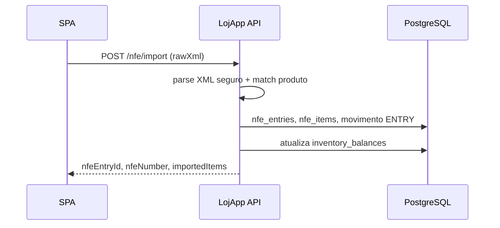

# LojApp — Loja Sistema

**Plataforma de Gestão Comercial com Automação Fiscal** (**LojApp**: API Spring Boot + SPA React neste repositório).

## Em 15 segundos

| Pergunta | Resposta |
|----------|----------|
| **O que é?** | SPA React + API Spring Boot para **gestão de loja física**: produtos, stock, vendas, importação de **NFe (XML)** e **dashboard** com KPIs, gráficos e **curva ABC**. |
| **Que problema resolve?** | Sai da planilha frágil e do ERP pesado: um fluxo **MVP real** — nota entra, stock atualiza, venda baixa saldo, indicadores apoiam **compra e precificação**. Dados **isolados por conta** (multi-loja: uma conta = uma loja). |
| **Como rodar?** | Postgres + `mvn spring-boot:run` na raiz; `cd frontend && npm install && npm run dev` — ver secção [Como rodar (local)](#como-rodar-local). |
| **Por que é especial?** | **JWT + refresh** com rotação, **rate limit**, **Actuator/Prometheus**, **auditoria**, API documentada (OpenAPI), frontend com **TanStack Query**, gráficos e **skeleton** no dashboard — stack alinhada a **produção**, não a demo descartável. |

---

## Screenshots (portfolio)

Coloque **capturas reais** em [`docs/screenshots/`](docs/screenshots/) com estes nomes (o recrutador precisa *ver* o produto):

| Ficheiro | Ecrã |
|----------|------|
| `01-login.png` | Login / registo |
| `02-dashboard.png` | Dashboard (KPIs + gráficos) |
| `03-vendas.png` | Histórico de vendas ou nova venda |
| `04-estoque.png` | Stock / inventário |
| `05-importacao-xml.png` | Importação NFe (XML) |
| `06-relatorios.png` | Vista de relatórios (ex.: tabela ABC / marcas no dashboard) |

Quando os ficheiros existirem, descomente o bloco abaixo no README (ou substitua por caminhos reais). **Estado atual:** a pasta só contém o guia — execute a app localmente, capture os ecrãs e faça commit dos PNG para o portfólio ganhar credibilidade imediata.

<!--


-->

Guia rápido: [`docs/screenshots/README.md`](docs/screenshots/README.md).

---

## Stack

| Camada | Tecnologia |
|--------|------------|
| API | Java 21, Spring Boot 3.4, JPA, Flyway, PostgreSQL |
| Segurança | JWT (access + **refresh** opaco com rotação), rate limit (Bucket4j), roles no token (`USER`/`ADMIN`) |
| Docs API | springdoc-openapi / Swagger (desligável em `prod`) |
| Observabilidade | Spring **Actuator** (health, info, **metrics**, **Prometheus**), logs com **correlation id** (`X-Request-Id` / MDC) |
| Frontend | React 19, Vite 6, TypeScript, **TanStack Query**, **Zustand**, **Recharts**, **Sonner** (toasts) |
| Testes | JUnit 5, Mockito, H2 (CI), Testcontainers + Postgres quando Docker disponível |

## Arquitetura (visão rápida)

```text
[ React SPA ]  -- JWT + refresh -->  [ REST /api/v1 ]
                                         |
                    +--------------------+--------------------+
                    |                    |                    |
              AuthController      LojApp controllers    Actuator /prometheus
                    |                    |                    |
               AuthService          Services          Métricas JVM/HTTP
                    |                    |
             refresh_tokens          Repositories (user_id em todo o lado)
             audit_logs              PostgreSQL (Flyway V1…V6)
```

- **Camadas:** controllers finos → `service` → `repository`; DTOs para contratos HTTP; entidades em `entity`.
- **Auditoria:** tabela `audit_logs` com eventos (`AUTH_LOGIN`, `SALE_CREATED`, `NFE_IMPORT`, `STOCK_ADJUST`, …).
- **Dashboard:** KPIs de stock (`/dashboard/inventory-kpis`), marcas (`/dashboard/brands`), **ABC por produto** (`/dashboard/products-abc`).

### Erros da API (formato estável)

Respostas de erro seguem `ApiErrorResponse` (tratamento em `GlobalExceptionHandler`):

```json
{
  "message": "Texto legível para o utilizador ou integrador.",
  "code": "VALIDATION_ERROR",
  "status": 400,
  "path": "/api/v1/lojapp/products",
  "timestamp": "2026-04-24T12:00:00Z"
}
```

O campo `code` usa valores do enum `ApiErrorCode` (ex.: `BAD_REQUEST`, `FORBIDDEN`, `CONFLICT`, `INTERNAL_ERROR`) ou o nome do estado HTTP em respostas via `ResponseStatusException`. O SPA lê este formato em `frontend/src/api.ts`.

## Fluxo principal

1. Registo/login → JSON com `accessToken` (só em memória no browser); refresh opaco em cookie HttpOnly (`lojapp_rt`, path `/api/v1/auth`). Ao abrir a app, tenta-se renovar o access a partir dessa cookie.
2. Cadastro de marcas/produtos; ajuste de stock ou entrada via **importação NFe**.
3. Vendas registam movimento `SALE` e reduzem saldo.
4. Dashboard consolida **faturamento/lucro por marca**, **top produtos**, **curva ABC** (faixas 80/15/5 %) e alertas de stock.

### Importação NFe → stock (sequência)



## Como rodar (local)

**Requisitos:** Java 21, Maven 3.9+, Node 20+, PostgreSQL 16+ (ou só Docker).

```bash
docker compose up -d db
mvn -q -DskipTests package
mvn spring-boot:run
# API em http://localhost:8080 (definido em application.yml). Alinhe o proxy Vite ou VITE_API_BASE se mudar a porta.
```

Frontend:

```bash
cd frontend
npm install
npm run dev
# http://localhost:3000 — proxy `/api` para a API em desenvolvimento (Vite)
# CSP: cabeçalho em dev e meta em `dist/index.html` após build (ver `frontend/vite.config.ts`).
```

Variáveis úteis:

| Variável | Descrição |
|----------|-----------|
| `LOJAPP_JWT_SECRET` | Segredo JWT (≥ 32 caracteres) |
| `SPRING_DATASOURCE_URL` | JDBC PostgreSQL |
| `LOJAPP_CORS_ORIGINS` | Origens CORS (produção) |
| `LOJAPP_TRUST_FORWARD_HEADERS` | `true` só atrás de reverse proxy de confiança (rate limit auth usa então `X-Forwarded-For`) |
| `VITE_API_BASE` | URL pública da API no build do frontend (sem barra final) |
| `VITE_CSP_CONNECT_SRC` | Origens extra em `connect-src` da CSP (ex.: API noutro domínio), separadas por espaço |

**Testes:**

```bash
mvn test
cd frontend && npm run lint
cd frontend && npm run test
cd frontend && npm run e2e
```

## Scripts operacionais

| Caminho | Objetivo |
|--------|----------|
| `scripts/verify-api-env.ps1` / `scripts/verify-api-env.sh` | Verifica variáveis e pré-requisitos da API antes de subir/deploy |
| `scripts/import-nfe-folder.sh` | Importa lote de XML de NFe para ambiente de teste |
| `scripts/run-nfe-integration-tests.sh` | Executa a bateria de testes de integração NFe |
| `scripts/git-untrack-frontend-artifacts.ps1` | Remove artefatos (`target`, `dist`, `node_modules`) do índice Git |

## Deploy (sugestão)

- **Backend:** imagem Docker (JAR + perfil `prod`), Postgres gerido (RDS, Supabase, Neon, etc.). Definir `SPRING_PROFILES_ACTIVE=prod`, `LOJAPP_JWT_SECRET` forte, `LOJAPP_CORS_ORIGINS` com o domínio do frontend.
- **Frontend:** build estático (`npm run build`) em **Vercel**, **Netlify**, **Cloudflare Pages** ou bucket S3; apontar `VITE_API_BASE` para a API.
- **Railway / Render / Fly.io / VPS:** um serviço para API + Postgres; outro ou CDN para o SPA.

**Ter uma demo online muda o jogo no portfolio.** Guia detalhado: [`docs/lojapp/10-guia-junior-piloto-deploy-proximos-passos.md`](docs/lojapp/10-guia-junior-piloto-deploy-proximos-passos.md).

## API — rotas principais (`/api/v1`)

| Método | Caminho | Descrição |
|--------|---------|-----------|
| POST | `/auth/register` | Registo → tokens |
| POST | `/auth/login` | Login → tokens |
| POST | `/auth/refresh` | Novo par access + refresh |
| GET | `/lojapp/dashboard/brands` | KPI por marca (`from`, `to`) |
| GET | `/lojapp/dashboard/products-abc` | Curva ABC / top produtos (`from`, `to`) |
| GET | `/lojapp/dashboard/inventory-kpis` | Totais de SKUs, unidades, stock baixo |
| … | `/lojapp/products`, `/sales`, `/nfe/import`, … | Ver Swagger em dev |

**Actuator:** em **desenvolvimento** expõe também `metrics` e `prometheus`. Em **`SPRING_PROFILES_ACTIVE=prod`** só `health` e `info` ficam expostos por defeito (ver `application-prod.yml`). Para Prometheus noutro ambiente, defina `LOJAPP_MANAGEMENT_ENDPOINTS_WEB_EXPOSURE_INCLUDE` (ex.: `health,info,prometheus`) e proteja na rede.

## Git: não versionar `node_modules`, `dist`, `target`, `build`

O [`.gitignore`](.gitignore) já exclui dependências e artefactos. Se **já foram commitados** por engano, remova do índice **sem apagar ficheiros locais** — isto é **obrigatório** para o repositório parecer profissional.

**Um comando (Windows), na raiz do clone onde existe `.git`:**

```powershell
powershell -ExecutionPolicy Bypass -File scripts/git-untrack-frontend-artifacts.ps1
```

O script faz `git rm -r --cached` em `frontend/node_modules`, `frontend/dist`, `target` e `build`, commit com a mensagem `remove arquivos desnecessários` e `git push`.

**Manual — Bash (macOS/Linux/Git Bash):**

```bash
git rm -r --cached frontend/node_modules frontend/dist target build 2>/dev/null || true
git commit -m "remove arquivos desnecessários"
git push
```

**Manual — PowerShell:**

```powershell
git rm -r --cached frontend/node_modules 2>$null
git rm -r --cached frontend/dist 2>$null
git rm -r --cached target 2>$null
git rm -r --cached build 2>$null
git commit -m "remove arquivos desnecessários"
git push
```

> **Nota:** A pasta “Loja Sistema” que só tem código no Cursor pode não ser o clone Git (sem `.git`). Abra o projeto no **GitHub Desktop** ou `cd` para a pasta do clone real e execute aí.

Confirme com `git status` que só entram ficheiros de código. O histórico antigo ainda pode conter blobs grandes — para apagar do remoto é preciso `git filter-repo` ou repositório novo (só se for problema de tamanho).

## Documentação de produto

- [Escopo MVP](docs/lojapp/01-escopo-mvp.md)
- [Guia júnior — deploy e próximos passos](docs/lojapp/10-guia-junior-piloto-deploy-proximos-passos.md)
- [Plano piloto MVP](.cursor/plans/piloto-mvp-rastreio.md)

## Próximos passos (ideias)

- PWA / offline leve; code-split do bundle do dashboard.
- `@PreAuthorize` por `app_role`; utilizador admin multi-loja.
- Soft delete em produtos; cache (Caffeine) em leituras quentes.
- Export CSV/PDF do dashboard; integração fiscal adicional.

## Origem

Código extraído e isolado do monorepo HH Financeiro v6 para este repositório dedicado ao produto LojApp.

Repositório GitHub: [HelderAbud/Sistema-Loja](https://github.com/HelderAbud/Sistema-Loja).
