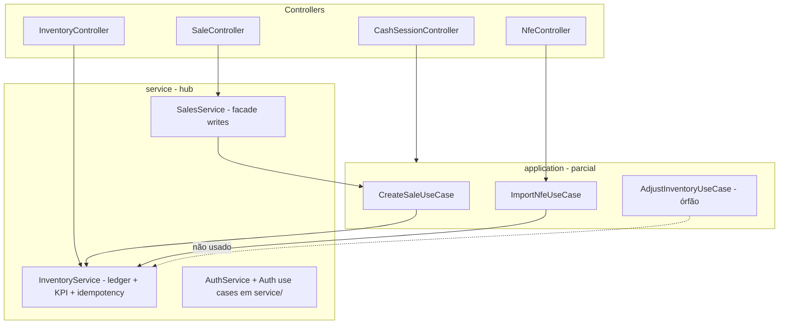

# Plano de aprofundamento arquitetural — LojApp

> Gerado via skill `improve-codebase-architecture`. Vocabulário: **module**, **interface**, **seam**, **depth**, **locality**, **leverage** ([LANGUAGE.md](../skills/improve-codebase-architecture/LANGUAGE.md)).

**Contexto:** backend declara controllers finos → `application` → `service`, mas a migração está incompleta. Frontend documenta camadas por feature, mas piloto ainda mistura HTTP e UI.

---

## Top recommendation

**Extrair núcleo Stock Ledger de `InventoryService` e manter idempotência só em `application`.**

| Critério | Por quê |
|----------|---------|
| Deletion test | Remover `InventoryService` espalha concorrência, saldo e audit para 5+ use cases — o módulo concentra gravidade real |
| Leaky seam | Ledger, KPIs, cache, idempotência HTTP e queries operacionais no mesmo contrato |
| Retorno imediato | `AdjustInventoryUseCase` órfão prova intento abandonado a meio — fechar o loop alinha padrão existente em vendas/NFe |
| Testes | `CreateSaleUseCaseTest` já mocka `InventoryServiceContract`; interface estreita aumenta leverage dos testes |

---

## Candidatos

### 1. Stock Ledger — `InventoryService` hub implícito

| | |
|---|---|
| **Força** | **Strong** |
| **Módulos** | `InventoryService`, `InventoryServiceContract`; consumidores: `CreateSaleUseCase`, `CreatePosSaleUseCase`, `CancelSaleUseCase`, `ImportNfeUseCase`, `InventoryController`, `DashboardController` |
| **Problema** | Interface larga: mutações com lock pessimista, idempotência HTTP, leituras operacionais e KPIs com `@Cacheable`. Seam vaza para vendas, NFe e dashboard |
| **Solução** | Extrair `StockLedger` (ou `InventoryMutationService`) com `decreaseForSale`, `restoreForCancelledSale`, `increaseFromNfe`, `applyManualAdjustment`. Leituras/KPIs em use cases ou `DashboardService`. Idempotência só na camada `application` |
| **Benefícios** | Locality das invariantes de stock; testes unitários do ledger sem Spring/cache; seam claro para fluxos transacionais |

### 2. `AdjustInventoryUseCase` órfão + idempotência duplicada

| | |
|---|---|
| **Força** | **Strong** |
| **Módulos** | `AdjustInventoryUseCase`, `InventoryController` (chama service direto), `InventoryService.adjustStock` |
| **Problema** | Use case existe e tem teste, mas controller não o usa. Idempotência duplicada (use case morto vs service ativo). Padrão oposto a `CreateSaleUseCase` |
| **Solução** | Controller injeta `AdjustInventoryUseCaseContract`; service expõe só mutação pura. Alternativa inferior: apagar use case e documentar idempotência no service |
| **Benefícios** | Uma seam HTTP→application; remove código morto; ArchUnit e docs consistentes |

### 3. Migração half-done: `application/` vs `service/` vs facades

| | |
|---|---|
| **Força** | **Worth exploring** |
| **Módulos** | Use cases em `application/` (cash, nfe, sale) vs `service/` (auth); facades `AuthService`, `SalesService` |
| **Problema** | Controllers injetam contratos diferentes. `SalesService.registerSale`/`cancelSale` são pass-through. Auth use cases fora de `application` |
| **Solução** | Regra única: transações multi-agregado + idempotência → `application`; CRUD/listagens → `service`. Mover auth para `application/auth`. Controllers de write injetam use cases (como POS) |
| **Benefícios** | Previsibilidade; menos módulos rasos; ArchUnit pode generalizar a regra |

### 4. Duplicação `CreateSaleUseCase` vs `CreatePosSaleUseCase`

| | |
|---|---|
| **Força** | **Worth exploring** |
| **Módulos** | `CreateSaleUseCase`, `CreatePosSaleUseCase`, `SaleRegistrationLine` |
| **Problema** | Núcleo produto → linha → persistência → baixa stock → audit copiado. POS só adiciona caixa/pagamentos |
| **Solução** | Componente interno `RegisterSaleWithStockDecrease` ou enriquecer domínio; use cases ficam com variantes POS |
| **Benefícios** | Correção de stock/audit propaga para ambos endpoints; menos divergência silenciosa |

### 5. Frontend: features rasas + `domain/` acoplado a `@/api`

| | |
|---|---|
| **Força** | **Strong** (frontend) |
| **Módulos** | `PilotoSaleTab`, `PilotoNfeTab`, `PilotoInventoryTab`, `brandKpis.ts`, `StorefrontPages.tsx` (~1600 linhas), tabs fora de `features/` |
| **Problema** | Doc diz `domain/` sem HTTP, mas `brandKpis.ts` importa `@/api`. Tabs piloto misturam Query, API, validação e UI. `StorefrontPages` monolítico |
| **Solução** | Hooks em `application/` por feature; tipos de domínio locais mapeados na application; migrar tabs órfãs; fatiar `StorefrontPages` |
| **Benefícios** | Interface testável (hooks mockáveis); alinhamento com `docs/lojapp/14-arquitetura-frontend-por-feature.md` |

### 6. Gaps de teste em use cases críticos

| | |
|---|---|
| **Força** | **Strong** |
| **Módulos** | Sem `*UseCaseTest`: `CreatePosSaleUseCase`, `CancelSaleUseCase`, `ApplyNfeImportSuggestionsUseCase`, cash open/close/preview. `LojappCoreServiceTest` monolítico |
| **Problema** | Regras POS (pagamento, caixa fechada), cancelamento com restauro, apply NFe difíceis de isolar. Contratos existem mas pouco testados na implementação |
| **Solução** | Unit test por use case (repos mock + `InventoryServiceContract`); manter 2–3 integrações finas (venda+stock, NFe+stock, POS+caixa); fatiar `LojappCoreServiceTest` |
| **Benefícios** | Regressão rápida; interface como test surface; menos `@SpringBootTest` por regra |

### 7. NFe: orquestração gorda

| | |
|---|---|
| **Força** | **Worth exploring** |
| **Módulos** | `ImportNfeUseCase`, `ApplyNfeImportSuggestionsUseCase`, `NfeProductResolver`, `NfeImportValidator`, `NfeXmlParser` |
| **Problema** | Use case god-object; parsing/validação/resolução espalhados sem portas. Apply relê XML via storage |
| **Solução** | Pipeline: parser → `NfeImportPolicy` (domain) → `ProductResolutionPort` (adapter). Use case só coordena transação |
| **Benefícios** | Testes puros para dedup sem chave (`docs/lojapp/16-nfe-xml-sem-chave-dedup.md`), matching EAN/marca |

### 8. `DashboardController` com seam duplo

| | |
|---|---|
| **Força** | **Speculative** |
| **Módulos** | `DashboardController` injeta `DashboardServiceContract` e `InventoryServiceContract` |
| **Problema** | KPI de inventário vaza para controller de dashboard |
| **Solução** | `GetInventoryKpisUseCase` ou método em `DashboardService`; controller com contrato único |

---

## Estado atual (mapa)

---

## Plano incremental sugerido

| PR | Escopo | Critério de aceite |
|----|--------|-------------------|
| **PR1** | Wiring `AdjustInventoryUseCase` + remover idempotência duplicada do service | Controller usa contrato application; `AdjustInventoryUseCaseTest` verde; ArchUnit ok |
| **PR2** | Extrair Stock Ledger de `InventoryService` | Mutations isoladas; KPIs/leituras fora do ledger; testes unitários do ledger |
| **PR3** | Unit tests: `CancelSaleUseCase`, `CreatePosSaleUseCase`, cash close/open | Cobertura de regras críticas sem `@SpringBootTest` |
| **PR4** | Consolidar regra application vs service (auth + sales writes) | Controllers de write consistentes; doc atualizada |
| **PR5** | Frontend: hooks `application/` nas features piloto | `domain/` sem import `@/api`; tabs migradas |
| **PR6** | Pipeline NFe com portas | Testes puros dedup/matching; use case &lt; orchestration |

---

## Próximo passo

Escolher candidato(s) para a **grilling loop** (design da interface, seams, testes). Recomendado começar por **PR1 + PR2** (stock ledger).
