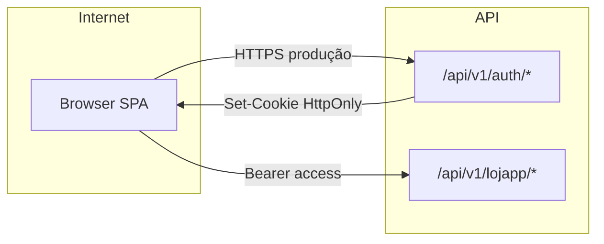

# Threat model leve — SPA + JWT + refresh (LojApp)

Documento curto para revisão de segurança e onboarding. Não substitui pentest nem análise formal de risco.

## 1. Contexto

| Ativo | Descrição |
|-------|-----------|
| Access JWT | Curta duração (~15 min); claims `sub`, `email`, `role`; HS256 com `LOJAPP_JWT_SECRET`. |
| Refresh opaco | Dois UUID concatenados; só hash SHA-256 na tabela `refresh_token`; cookie HttpOnly `lojapp_rt` (path `/api/v1/auth`). |
| Conta utilizador | Email + palavra-passe (hash BCrypt); isolamento por `user_id` nos dados operacionais. |

**Confiança:** browser do utilizador (SPA), API Spring Boot, PostgreSQL, opcional Redis (rate limit). **Não confiar:** conteúdo de pedidos anónimos, cabeçalhos `Origin`/`Referer` sem validação, `X-Forwarded-For` sem reverse proxy configurado (`LOJAPP_TRUST_FORWARD_HEADERS`).

## 2. Limites de confiança

- **CSRF clássico:** Spring CSRF está desligado para API stateless; **refresh/logout** exigem origem permitida (`AuthCsrfGuardFilter` + CORS fechado).
- **XSS:** access JWT em memória da SPA é mais exposto que refresh HttpOnly; mitigar com CSP, sanitização de HTML e dependências atualizadas.

## 3. Ameaças principais e mitigações

| Ameaça | Mitigação actual | Residual |
|--------|------------------|----------|
| Roubo de refresh (malware, extensão) | Um refresh válido por utilizador na BD (novo login substitui o anterior); rotação apaga o token usado. | Se o ladrão usar o token **antes** da vítima refrescar, obtém sessão até a vítima voltar a autenticar. Não há deteção automática de “reuse” que revogue todas as sessões. |
| Replay do refresh após rotação | Segundo uso devolve 401 (`Refresh token inválido`). | Métrica `lojapp.auth.refresh` com `outcome=invalid` ajuda a monitorizar picos. |
| Força bruta em login/register | Rate limit por IP (memória ou Redis); registo com limite horário por IP. | IPs partilhados / botnets; CAPTCHA não implementado (ver convite opcional). |
| Registo abuso | Registo desligado por defeito; allowlist de domínios; opcional `LOJAPP_REGISTRATION_INVITE_SECRET` + campo `inviteToken`. | Domínio vazio + registo ligado = superfície maior (exige política operacional). |
| JWT access vazado | TTL curto; sem refresh não renova. | Janela até expiração; não há blocklist de JWT por defeito. |
| MITM | Produção: HTTPS + `refresh-cookie-secure=true` + SameSite `Lax`. | — |

## 4. Rotação e revogação (resumo de implementação)

- **Login / registo / refresh bem-sucedido:** `issueTokens` remove **todos** os refresh tokens do utilizador e grava **um** novo par access+refresh.
- **Refresh:** lê hash, valida expiração, **apaga** a linha, emite novo par.
- **Logout:** apaga a linha correspondente ao token apresentado (cookie).

## 5. Evolução recomendada (fora desta fase)

- Deteção de reuse agressiva (invalidar família de tokens ao detectar token já consumido).
- MFA para contas sensíveis.
- CAPTCHA no registo público se `invite-secret` não for usado.
- Scan OWASP ZAP na pipeline (Fase D do guia de evolução).
