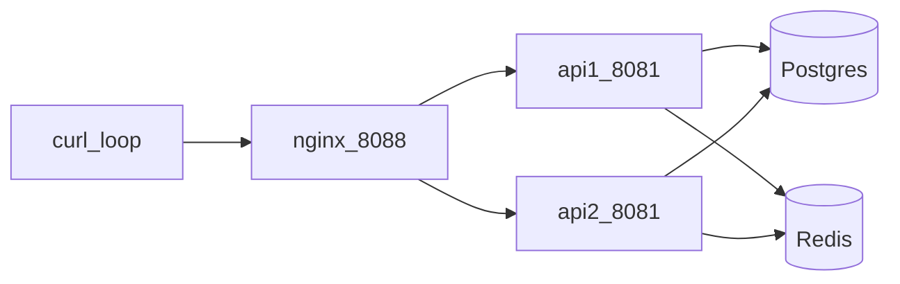

# Etapa portfólio — HA local (sem AWS)

**Honestidade primeiro:** isto demonstra **duas réplicas da API atrás de nginx** no teu PC via Docker Compose.  
**Não** é AWS ALB, NLB, ECS, EKS, Elastic Beanstalk nem multi-AZ. Em entrevista: “HA de laboratório local para falar de sticky sessions, rate limit partilhado e health atrás de um proxy.”

**Trilha:** Fase E · Dias 19–21 · Helder Simple (doc + exemplo Compose).

---

## Objetivo

| Peça | Papel |
|------|--------|
| `api1` + `api2` | Duas JVMs Spring Boot (mesmo JAR) |
| `db` + `redis` | Estado partilhado (Postgres + rate limit Redis) |
| `nginx` | Proxy HTTP em `localhost:8088` |
| `scripts/ha-curl-loop.sh` | Loop de `GET /actuator/health` + header `X-Lojapp-Upstream` |



---

## Ficheiros

| Ficheiro | Conteúdo |
|----------|----------|
| [`docker-compose.ha.yml`](../../docker-compose.ha.yml) | Stack HA local |
| [`deploy/ha/nginx.conf`](../../deploy/ha/nginx.conf) | upstream `least_conn` |
| [`scripts/ha-curl-loop.sh`](../../scripts/ha-curl-loop.sh) | loop de health |

---

## Como subir (lab)

Pré-requisitos: Docker, `.env` na raiz com `POSTGRES_PASSWORD` e `LOJAPP_JWT_SECRET` (≥32).  
**Não** uses o mesmo volume/porta que o `docker-compose.yml` diário em paralelo sem cuidado (Postgres HA usa volume `lojapp_ha_pgdata`; proxy usa **8088**).

```bash
# Na raiz do repo
cp -n .env.example .env   # se ainda não tens .env
docker compose -f docker-compose.ha.yml up -d --build
# Esperar health das APIs (~1–2 min no primeiro build)
curl -i http://127.0.0.1:8088/actuator/health
chmod +x scripts/ha-curl-loop.sh
./scripts/ha-curl-loop.sh
```

PowerShell (WSL para o script bash, ou curl manual):

```powershell
docker compose -f docker-compose.ha.yml up -d --build
curl.exe -i http://127.0.0.1:8088/actuator/health
wsl -e bash scripts/ha-curl-loop.sh
```

Parar:

```bash
docker compose -f docker-compose.ha.yml down
# apagar dados do lab: docker compose -f docker-compose.ha.yml down -v
```

---

## O que observar no loop

1. Vários `200` seguidos.  
2. Header `X-Lojapp-Upstream` a apontar para `api1:8081` e/ou `api2:8081` (distribuição).  
3. Com `LOJAPP_RATE_LIMIT_MODE=redis`, o limite de login/registo é **partilhado** entre réplicas (diferente do modo `memory` no Render free tier).

---

## Limitações (dizer na entrevista)

- Single host / single Docker daemon — falha da máquina = falha total.  
- Sem TLS, sem WAF, sem auto-scaling.  
- Session JWT: access em memória no browser; refresh cookie — sem sticky session obrigatória para REST stateless, mas cookies SameSite/domínio ainda importam atrás de proxy.  
- Deploy público do portfólio continua **1 instância Render** (Fase B), não este Compose.

---

## Tags

`nginx` · `Docker Compose` · `health` · `Redis rate limit` · `lab HA` · `not AWS`
