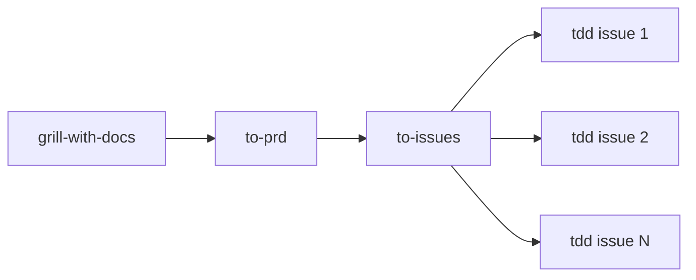

# Plano Consolidado de Melhorias — LojApp Pro

**Data:** 2026-05-24  
**Público-alvo:** dev júnior (com revisão de pleno/sênior no grill)  
**Fontes:** exploração do repo, `CHECKLIST_FINAL.md`, `docs/lojapp/code-review-2026-05-24.md`, `.cursor/plans/architecture-deepening-plan.md`

---

## Como usar este documento (leia antes de codar)

Este arquivo é o **ponto de partida oficial** do projeto. Não comece nenhuma tarefa só lendo o título — siga a ordem abaixo.

### Regra de ouro

```
1. Ler a fase + tarefa neste plano
2. Escolher fluxo enxuto ou completo (secção "Fluxo de skills" abaixo)
3. grill-with-docs (SEMPRE — alinhar domínio antes de qualquer coisa)
4. to-prd → to-issues (SÓ se epic / várias pessoas / tracker)
5. tdd — implementar com RED→GREEN por slice (nunca "todos os testes de uma vez")
6. Validar com comandos da tarefa
7. Atualizar docs + marcar CHECKLIST_FINAL.md
8. Pedir review antes da próxima fase
```

### Ordem de execução (não pule)

| Ordem | Fase | Bloqueia publicação GitHub? |
|-------|------|----------------------------|
| 0 | Setup + grill inicial | Sim (alinhamento) |
| 1 | **Fase A** — Portfolio | **Sim** |
| 2 | **Fase B** — Blockers técnicos | **Sim** |
| 3 | Fase C — Arquitetura backend | Não (recomendado p/ entrevista) |
| 4 | Fase D — Frontend | Não |
| 5 | Fase E — CI e docs | Não |
| 6 | Fase F — P2 | Não |

**Gate GitHub:** Fase A + Fase B 100% concluídas + checklist P0 fechado.

### Leitura obrigatória (dia 0, ~2h)

| Documento | Por quê |
|-----------|---------|
| [`AGENTS.md`](../../AGENTS.md) | Stack, comandos, regras de camada |
| [`CHECKLIST_FINAL.md`](../../CHECKLIST_FINAL.md) | O que falta para publicar |
| [`docs/lojapp/code-review-2026-05-24.md`](../../docs/lojapp/code-review-2026-05-24.md) | Bugs e blockers explicados |
| [`docs/lojapp/10-guia-junior-piloto-deploy-proximos-passos.md`](../../docs/lojapp/10-guia-junior-piloto-deploy-proximos-passos.md) | Rodar o sistema local |
| [`docs/lojapp/11-checklist-pr-e-convencoes-repositorio.md`](../../docs/lojapp/11-checklist-pr-e-convencoes-repositorio.md) | Como abrir PR |
| [`docs/lojapp/13-estoque-concorrencia-e-idempotencia.md`](../../docs/lojapp/13-estoque-concorrencia-e-idempotencia.md) | Domínio crítico (stock) |
| [`docs/lojapp/14-arquitetura-frontend-por-feature.md`](../../docs/lojapp/14-arquitetura-frontend-por-feature.md) | Onde colocar código FE |

### Setup local mínimo

```bash
# Terminal 1 — banco
docker compose up -d

# Terminal 2 — API (porta 8000 com mvn)
mvn spring-boot:run

# Terminal 3 — frontend
cd frontend && npm install && npm run dev
```

Health check: `curl http://localhost:8000/actuator/health`

---

## Fluxo de skills — grill → to-prd → to-issues → tdd

> Skills em `.cursor/mattpocock/skills/engineering/` (ou `.cursor/skills/`).  
> **Pré-requisito once por repo:** `setup-matt-pocock-skills` (issue tracker + labels) antes de `to-prd` / `to-issues`.

### Fluxo canônico (feature nova ou epic)

Use quando o escopo é **grande**, **novo** ou envolve **várias pessoas** no GitHub Issues:

```
grill-with-docs  →  to-prd  →  to-issues  →  tdd (por issue)
     alinhar           formalizar     fatiar          implementar
```

| Etapa | Skill | O que faz | Por quê nesta ordem |
|-------|-------|-----------|---------------------|
| 1 | **grill-with-docs** | Entrevista técnica; `CONTEXT.md`; ADRs | Sem alinhamento, PRD e issues nascem com linguagem errada ou decisões implícitas |
| 2 | **to-prd** | Consolida conversa num PRD (issue no tracker) | **Não entrevista** — só sintetiza o que o grill já resolveu |
| 3 | **to-issues** | Quebra PRD/plano em **vertical slices** (tracer bullets) | Cada issue = caminho fino mas **completo** (schema + API + testes + UI se couber) |
| 4 | **tdd** | RED→GREEN→refactor **por issue**, um teste de cada vez | Evita slice horizontal ("escrever todos os testes, depois todo o código") |



### Quando NÃO usar a cadeia inteira

| Situação | Fluxo enxuto | Por quê |
|----------|--------------|---------|
| Bug pequeno (B1, B2, B4) | **grill → tdd** | PRD + issues = overhead desnecessário |
| Tarefa do plano com DoD claro (A1, A2, B3) | **grill → tdd** | Plano já substitui PRD |
| Trabalho solo, sem GitHub Issues | **grill → tdd** | `to-issues` só faz sentido com tracker |
| Descoberta do que melhorar | **improve-codebase-architecture → grill** | Já feito neste repo (`architecture-deepening-plan.md`) |

**Regra prática:**

- **Epic / feature nova / paralelizar no tracker** → cadeia completa  
- **Item do plano consolidado com passos e DoD** → grill da tarefa → tdd → PR  

### Detalhes que confundem júnior (leia antes de errar)

1. **`to-prd` vem DEPOIS do grill**, nunca antes — senão formaliza dúvidas não resolvidas.
2. **`to-issues` vem ANTES do tdd**, não depois — implementa **uma issue por vez**.
3. **Grill pode repetir** — por fase/tarefa ou quando triage marcar issue como incompleta.
4. **TDD = vertical, não horizontal** — por slice: `1 teste → 1 impl → repeat`; não "todos os testes do PRD".
5. **`tdd` exige aprovação** do que testar antes de codar (comportamentos, não detalhes de implementação).

### Anti-pattern TDD (proibido)

```
ERRADO (horizontal):
  RED:   test1, test2, test3, test4, test5
  GREEN: impl1, impl2, impl3, impl4, impl5

CERTO (vertical — tracer bullet):
  RED→GREEN: test1 → impl1
  RED→GREEN: test2 → impl2
  ...
```

### Qual fluxo usar em cada bloco deste plano

| Bloco | Fluxo recomendado | Skills |
|-------|-------------------|--------|
| Fase 0 | Alinhamento inicial | grill-with-docs |
| Fase A (portfolio) | Tarefas operacionais | grill → execução (sem tdd em A1/A3/A4) |
| Fase B (blockers P0) | Bugs com teste de regressão | **grill → tdd** |
| PR1 (`AdjustInventoryUseCase`) | Decisão arquitetural | grill + ADR → **tdd** |
| PR2 (Stock Ledger) | Epic grande | grill + ADR → **to-prd → to-issues → tdd** por issue |
| PR3 (testes use cases) | Vários módulos | grill → **to-issues** (opcional) → **tdd** |
| PR4 (regra application/service) | Governança | grill → doc `AGENTS.md` (+ ADR se necessário) |
| PR5 (frontend) | Epic FE | grill → **to-prd → to-issues → tdd** |
| Fase E (CI/JaCoCo) | Infra | grill curto → implementação direta |

### Prompts por skill (copie e adapte)

**to-prd** (após grill de epic concluído):

```
Use a skill to-prd.

Contexto: sessão grill em docs/lojapp/grill-logs/[arquivo].md
Plano: .cursor/plans/plano-consolidado-melhorias-2026-05-24.md
Epic: [PR2 Stock Ledger | PR5 Frontend | etc.]

Sintetize o PRD a partir do grill (não entreviste de novo).
Confirme módulos a tocar e quais terão testes.
Publique no issue tracker com label ready-for-agent.
```

**to-issues** (após PRD publicado):

```
Use a skill to-issues.

Fonte: issue/PRD #[número] ou secção [PR2] deste plano.
Regras: vertical slices (tracer bullets), preferir AFK sobre HITL.
Apresente breakdown numerado; pergunte granularidade antes de publicar.
```

**tdd** (por issue ou tarefa):

```
Use a skill tdd.

Issue/tarefa: [B1 | issue #42 | etc.]
Grill log: docs/lojapp/grill-logs/[arquivo].md

Antes de codar: confirme interface pública e comportamentos a testar.
Depois: RED→GREEN por slice — um teste de cada vez.
```

### Artefatos por fluxo

| Fluxo | Artefatos obrigatórios |
|-------|------------------------|
| Enxuto (grill → tdd) | grill log + testes + PR |
| Completo (grill → prd → issues → tdd) | grill log + PRD (issue) + N issues filhas + testes + PR por issue |

**Gate de PR (ambos os fluxos):** link para grill log no corpo do PR. Se veio de issue, referenciar `#número`.

---

## OBRIGATÓRIO: grill-with-docs antes de cada fase

> **Skill:** `.cursor/mattpocock/skills/engineering/grill-with-docs/SKILL.md`  
> **Objetivo:** stress-testar o plano contra o domínio real, eliminar dúvidas **antes** de codar, e registrar decisões.

### O que é o grill?

É uma **entrevista técnica** (com Cursor ou revisor humano) onde cada decisão do plano é questionada:

- "Por que assim e não de outro jeito?"
- "Isso bate com o código existente?"
- "Qual termo de domínio usar?"

**Não pule.** Codar sem grill em tarefas de arquitetura/segurança costuma gerar PR grande, revertido ou inconsistente com o projeto.

### Como iniciar a sessão (copie e cole no Cursor)

```
Use a skill grill-with-docs.

Ponto de partida: .cursor/plans/plano-consolidado-melhorias-2026-05-24.md
Fase que vou executar: [A1 | B1 | PR1 | etc.]

Antes de eu codar:
1. Leia a tarefa no plano e os docs referenciados
2. Explore o código relacionado
3. Faça perguntas UMA DE CADA VEZ até alinharmos
4. Para cada resposta, diga sua recomendação
5. Atualize CONTEXT.md quando um termo ficar claro
6. Proponha ADR só se for difícil reverter + surpreendente + trade-off real

Ao final, gere o resumo da sessão no formato da secção "Template de log" deste plano.
```

### Artefatos que o grill produz (obrigatório)

| Artefato | Quando criar | Onde |
|----------|--------------|------|
| **Log da sessão** | Sempre, ao fim de cada grill | `docs/lojapp/grill-logs/YYYY-MM-DD-fase-XX.md` |
| **`CONTEXT.md`** | Primeira sessão; atualizar quando termo novo surgir | Raiz do repo (`CONTEXT.md`) |
| **ADR** | Só decisões difíceis de reverter (ver abaixo) | `docs/adr/NNNN-slug.md` |

**Gate:** PR só pode ser aberto se existir log de grill para aquela tarefa (link no corpo do PR).

### Template de log (`docs/lojapp/grill-logs/`)

Crie a pasta no primeiro grill. Nome do ficheiro: `2026-05-24-fase-B1-error-controller.md`

```markdown
# Grill — [ID da tarefa, ex. B1]

**Data:** YYYY-MM-DD  
**Participantes:** [seu nome] + [revisor/agente]  
**Plano:** .cursor/plans/plano-consolidado-melhorias-2026-05-24.md

## Escopo desta sessão
[1–2 frases: o que vamos mudar]

## Perguntas respondidas
| # | Pergunta | Resposta acordada | Recomendação do revisor |
|---|----------|-------------------|-------------------------|
| 1 | ... | ... | ... |

## Termos atualizados em CONTEXT.md
- **[Termo]**: definição acordada

## ADRs criados
- [ ] Nenhum
- [ ] `docs/adr/0001-....md` — motivo: ...

## Decisões técnicas (checklist pré-código)
- [ ] Li os ficheiros listados na tarefa
- [ ] Sei o que NÃO vou mudar (escopo)
- [ ] Sei como validar (comandos)
- [ ] Branch criada: `fix/B1-error-controller` (exemplo)

## Riscos / dúvidas remanescentes
- ...

## Aprovado para codar?
- [ ] Sim — assinatura/review: ___
- [ ] Não — pendências: ___
```

### Perguntas padrão do grill (por tipo de tarefa)

Use como checklist durante a sessão. O agente deve fazer **uma pergunta por vez**.

**Segurança (A2, B1):**
- Que dados nunca podem aparecer na resposta HTTP?
- O que já está configurado em `application.yml` que a mudança deve respeitar?
- Como provar com teste que não vazou?

**API/erros (B1, B2):**
- Qual o contrato JSON padrão (`ApiErrorResponse`)?
- Cliente (frontend) espera qual status code?
- Erro de validação vs erro interno — mesma mensagem?

**Arquitetura (PR1–PR4):**
- Controller pode chamar service ou use case neste fluxo?
- Onde fica idempotência HTTP — service ou application?
- O que `AdjustInventoryUseCase` faz hoje vs o que `InventoryService.adjustStock` faz?

**Frontend (PR5):**
- O que pode importar `@/api` — domain ou só application?
- Mensagem de erro amigável vs técnica — padrão existente?

### Quando criar ADR (não exagere)

Crie ADR **somente** se **as 3** forem verdadeiras:

1. Difícil reverter depois  
2. Futuro leitor vai perguntar "por que assim?"  
3. Houve alternativa real (não foi óbvio)

**Candidatos a ADR neste plano:**

| Tarefa | ADR sugerido | Por quê |
|--------|--------------|---------|
| PR1 | `0001-idempotencia-somente-em-application.md` | Decisão arquitetural; hoje está duplicada |
| PR2 | `0002-stock-ledger-separado-de-leituras-kpi.md` | Molda todos os fluxos de stock |
| F8 | `0003-rbac-cashier-vs-user-sem-cross-grant.md` | Comportamento surpreendente se mudar |

Tarefas como "corrigir typo" ou "adicionar screenshot" **não** precisam de ADR.

---

## Glossário mínimo LojApp (use estes termos no grill)

| Termo | Significa | Não confundir com |
|-------|-----------|-------------------|
| **Loja / tenant** | Dados isolados por `user_id` | "Usuário" genérico |
| **Stock / estoque** | Saldo de produto; nunca negativo | "Inventário" como relatório |
| **Ajuste manual** | Mudança de stock fora de venda/NFe | Venda PDV |
| **Idempotência** | Mesma chave HTTP = mesma resposta, sem efeito duplicado | Cache |
| **Use case** | Orquestração transacional em `application/` | Service CRUD |
| **NFe (neste MVP)** | Importação de XML offline | Emissão ou consulta SEFAZ |

Após o grill inicial, formalize termos em `CONTEXT.md` na raiz (ainda não existe — **criar na Fase 0**).

---

## Fase 0 — Grill inicial (meio dia)

**Objetivo:** alinhar vocabulário e prioridade antes de tocar em código.

### Passos

1. Rodar prompt grill-with-docs para **Fase A + Fase B** (visão geral).
2. Criar `CONTEXT.md` na raiz com 5–10 termos do glossário acima.
3. Criar `docs/lojapp/grill-logs/` + primeiro log.
4. Confirmar com revisor: "Posso começar A2 + B1?"

### DoD Fase 0

- [ ] `CONTEXT.md` existe na raiz
- [ ] Log `grill-logs/...-fase-0-setup.md` preenchido
- [ ] Dúvidas bloqueantes anotadas (se houver, resolver antes de A1)

---

## Fase A — Bloqueantes de portfolio (P0)

> **Por que esta fase existe:** o código pode funcionar, mas o **GitHub/recrutador** reprova repo sem screenshots, com senhas no Git, ou README fraco. Esta fase não melhora arquitetura — melhora **empregabilidade**.

---

### A1 — Evidências visuais (screenshots + GIF)

| | |
|---|---|
| **Prioridade** | P0 — bloqueia publicação |
| **Estimativa** | 2–4 h |
| **Depende de** | API + FE rodando local |
| **Referência CHECKLIST** | Fase 1 Passo 4; secção 7.2 |

#### Por que fazer?

Recrutadores gastam **menos de 2 minutos** no README. Sem imagens, o projeto parece "só código morto no GitHub", mesmo com boa arquitetura.

#### O que acontece se não fizer?

README promete screenshots em `docs/screenshots/` que **não existem** → links quebrados → impressão de projeto incompleto.

#### O que você vai entregar

- 6–7 PNG + 1 GIF curto em `docs/screenshots/`
- README apontando para ficheiros reais

#### Grill-with-docs — perguntas antes de capturar

1. Qual fluxo mostra **valor de negócio** em 30 segundos? (sugestão: login → dashboard → venda)
2. Dados sensíveis na tela? (mascarar e-mail/CNPJ se necessário)
3. Resolução consistente? (sugestão: mesma largura de janela)

**Docs a ler:** `docs/screenshots/README.md`

#### Passo a passo

1. Subir stack (ver Setup local).
2. Login com usuário de demo (criar se não existir — ver `docs/lojapp/02-pilotos-e-xmls.md`).
3. Capturar telas:
   - `01-login.png`
   - `02-dashboard.png`
   - `03-produtos.png`
   - `04-venda.png`
   - `05-estoque.png`
   - `06-nfe-import.png`
   - `07-pdv.png` (se aplicável)
4. Gravar GIF ~30s: login → dashboard → registrar venda.
5. Salvar em `docs/screenshots/`.
6. Atualizar `README.md` — conferir que paths batem.

#### Como validar

```bash
# Windows PowerShell — ficheiros existem?
Get-ChildItem docs/screenshots/*.png, docs/screenshots/*.gif

# Abrir README no preview e clicar cada imagem
```

#### Definition of Done

- [ ] Grill log `grill-logs/...-A1-screenshots.md`
- [ ] Todas imagens referenciadas no README existem
- [ ] GIF < 5 MB (comprimir se necessário)
- [ ] `CHECKLIST_FINAL.md` Passo 4 marcado `[x]`

#### Docs a atualizar

- `README.md`
- `CHECKLIST_FINAL.md`

---

### A2 — Segredos fora do Git

| | |
|---|---|
| **Prioridade** | P0 — bloqueia publicação + risco segurança |
| **Estimativa** | 2–3 h |
| **Depende de** | Fase 0 |
| **Referência** | Code review B4; CHECKLIST 4.1, 8.1 |

#### Por que fazer?

`docker-compose.yml` versionado contém **senha de banco e JWT secret reais**. Qualquer pessoa com acesso ao repo pode:

- Forjar tokens JWT da aplicação
- Rodar ambiente idêntico ao seu com credenciais conhecidas
- Falhar scan Trivy no CI

**Princípio:** segredos vivem em `.env` (gitignored) ou secret manager — **nunca** no histórico Git.

#### O que acontece se não fizer?

Reprovacao em review de segurança; portfolio vira **anti-exemplo**; se JWT vazou, tokens antigos ainda válidos até rotação.

#### O que você vai mudar

- `docker-compose.yml` → variáveis `${POSTGRES_PASSWORD:?}`, `${LOJAPP_JWT_SECRET:?}`, etc.
- `.env.example` → chaves **sem valores reais**
- `.gitignore` → garante `.env` ignorado
- README → instrução "copie `.env.example` para `.env`"

#### O que NÃO fazer

- Commitar ficheiro `.env` com valores reais
- Usar segredos de produção no exemplo
- Remover validação `:?` (compose deve **falhar** se variável faltar)

#### Grill-with-docs — perguntas

1. Quais variáveis o `docker-compose.prod.yml` já exige? (copiar padrão)
2. `LOJAPP_REGISTRATION_ENABLED: true` no dev — intencional? (dev sim, documentar)
3. JWT já foi commitado? Se sim, **rotacionar** após mudança

**Docs a ler:** `docker-compose.prod.yml`, `.env.example`, `application.yml`

#### Passo a passo

1. Listar segredos hardcoded:
   ```bash
   rg "123456|SegredoSuperForte|POSTGRES_PASSWORD:" docker-compose.yml
   ```
2. Criar/atualizar `.env.example` com todas as chaves necessárias (valores vazios ou placeholders óbvios tipo `change-me`).
3. Alterar `docker-compose.yml` para usar `${VAR:?mensagem}`.
4. Criar `.env` local (não commitar) a partir do example.
5. Testar:
   ```bash
   docker compose down
   docker compose up -d
   curl http://localhost:8080/actuator/health   # ou porta mapeada
   ```
6. Se JWT antigo vazou: gerar novo secret ≥ 32 bytes; documentar rotação.
7. Verificar `.gitignore` inclui `.env`, `.env.local`, `*.pem`.

#### Como validar

```bash
# Nenhum segredo literal no compose
rg "123456|SegredoSuperForte" docker-compose.yml
# Deve retornar vazio

# .env não tracked
git status --ignored | findstr .env
```

#### Definition of Done

- [ ] Grill log + decisão sobre `REGISTRATION_ENABLED` documentada
- [ ] `docker compose up` funciona com `.env`
- [ ] `.env.example` sem segredos reais
- [ ] CHECKLIST 4.1 e Passo 5 marcados

---

### A3 — Pitch e narrativa técnica

| | |
|---|---|
| **Prioridade** | P0 (CHECKLIST 9.1) |
| **Estimativa** | 2 h |

#### Por que fazer?

Em entrevista, você tem 60–90 segundos. Pitch memorizado + 3 histórias de bug/risco **provam senioridade** melhor que "eu fiz Spring Boot".

#### Entregável

Criar `docs/lojapp/pitch-portfolio.md` com:

1. **Pitch 60–90s** — problema → solução → stack → diferenciais
2. **3 casos** formato: *Risco → O que fizemos → Evidência (teste/doc)*
   - Sugestões: idempotência stock, isolamento `user_id`, Flyway validate + Testcontainers

#### Grill — perguntas

1. Qual problema de **loja física real** o LojApp resolve?
2. Qual diferencial técnico é **verificável** (não marketing)?

#### DoD

- [ ] Grill log
- [ ] `pitch-portfolio.md` revisado por par
- [ ] CHECKLIST 9.1 itens pitch/diferenciais marcados

---

### A4 — Commits organizados + ZIP seguro

| | |
|---|---|
| **Prioridade** | P0 |
| **Estimativa** | 1–2 h |

#### Por que fazer?

Histórico `fix stuff` / commits gigantes assustam recrutador. ZIP com `.env` ou `target/` **vaza segredo ou parece amador**.

#### Passo a passo

1. Agrupar mudanças pendentes em commits temáticos (`feat:`, `fix:`, `docs:`).
2. Rodar `scripts/package-source-safe.ps1` (ou manualmente excluir `.env`, `target/`, `node_modules/`, `backup.sql`).
3. Extrair ZIP em pasta nova; tentar `mvn test` e `npm run lint`.

#### DoD

- [ ] ZIP testado em pasta limpa
- [ ] CHECKLIST anti-vazamento L311–321 marcado

---

## Fase B — Blockers técnicos (P0)

> **Por que esta fase existe:** bugs que quebram **contrato API**, **segurança** ou **operacao local**. Recrutador técnico ou CI avançado vai encontrar.

**Ordem obrigatória:** B1 → B2 → B3 → B4 (B4 pode paralelizar com B3).

---

### B1 — Sanitizar `LojappErrorController`

| | |
|---|---|
| **Prioridade** | P0 blocker |
| **Estimativa** | 2–4 h |
| **Ficheiro principal** | `src/main/java/com/lojapp/exception/LojappErrorController.java` |

#### Por que fazer?

Quando erro acontece **fora** do `GlobalExceptionHandler` (filtros, Tomcat, Redis down), o controller atual manda `ex.getMessage()` para o cliente. Isso pode expor:

- Detalhes SQL (`duplicate key`, nome de constraint)
- Host interno Redis
- Caminhos de classe

O projeto **já decidiu** não expor mensagens (`server.error.include-message: never` em `application.yml`). Este ficheiro **contorna** essa decisão.

#### O que acontece se não fizer?

Atacante ou usuário curioso vê stack interna; auditoria de segurança reprova; inconsistente com resto da API.

#### Comportamento desejado (simples)

| Situação | HTTP | Corpo JSON |
|----------|------|------------|
| Erro interno (5xx) | 500 | Mensagem genérica fixa ("Erro interno") |
| Erro cliente conhecido (4xx) | 4xx | Mensagem segura whitelist |
| Qualquer caso | — | Detalhe completo **só no log** server-side |

#### Grill — perguntas obrigatórias

1. Qual classe de teste usar como modelo? → ver `GlobalExceptionHandlerTest`
2. Frontend depende de formato específico neste path? → ver `frontend/src/api.ts`
3. Precisa ADR? → **Não** (restaura policy existente)

**Ler antes:** `LojappErrorController.java`, `GlobalExceptionHandler.java`, `ApiErrorResponse.java`

#### Passo a passo

1. Sessão grill → log aprovado
2. Branch `fix/B1-sanitize-error-controller`
3. Alterar `buildMessage()`:
   - Remover retorno direto de `root.getMessage()` para 5xx
   - Usar mensagem genérica alinhada ao `GlobalExceptionHandler`
4. Adicionar log ERROR com stack trace completo (server-side)
5. Criar `LojappErrorControllerTest`:
   - Simular exceção com mensagem sensível `"relation \"foo\" does not exist"`
   - Assert: corpo **não** contém essa string
6. `mvn test -Dtest=LojappErrorControllerTest`

#### Como validar

```bash
mvn test -Dtest=LojappErrorControllerTest
mvn test   # suite completa
```

#### DoD

- [ ] Grill log
- [ ] Teste de regressão verde
- [ ] PR com link para code review B1
- [ ] Reviewer aprovou

---

### B2 — Handler `HandlerMethodValidationException`

| | |
|---|---|
| **Prioridade** | P0 blocker |
| **Estimativa** | 2–3 h |
| **Ficheiros** | `GlobalExceptionHandler.java`, `DashboardController.java` |

#### Por que fazer?

Dashboard usa `@Min(0)` em query params (`brandOffset`). Valor `-1` deveria ser **erro do cliente (400)**, mas hoje vira **500 Internal Server Error** porque Spring Boot 3 lança `HandlerMethodValidationException` e ninguém trata.

**Impacto UX:** frontend mostra "erro do servidor" quando usuário (ou bug) manda param inválido — engana debugging.

#### Comportamento desejado

```
GET /api/v1/lojapp/dashboard/...?brandOffset=-1
→ 400 Bad Request
→ { "code": "VALIDATION_ERROR", "message": "...", ... }
```

#### Grill — perguntas

1. Já existe `ApiErrorCode.VALIDATION_ERROR`? Confirmar no código.
2. Outros controllers usam `@Validated` em query params? (grep) — handler central resolve todos.

#### Passo a passo

1. Grill + log
2. Branch `fix/B2-validation-exception-handler`
3. Em `GlobalExceptionHandler`, adicionar:
   ```java
   @ExceptionHandler(HandlerMethodValidationException.class)
   ```
4. Mapear para `ApiErrorResponse` + status 400 (copiar estilo de handlers existentes)
5. Teste: `GlobalExceptionHandlerTest` ou teste de integração dashboard
6. `mvn test`

#### DoD

- [ ] Grill log
- [ ] Teste prova 400 (não 500)
- [ ] CI verde

---

### B3 — Scripts backup/restore alinhados ao Compose

| | |
|---|---|
| **Prioridade** | P0 |
| **Estimativa** | 2 h |
| **Ficheiros** | `scripts/backup-postgres-docker.ps1`, `scripts/restore-postgres-docker.ps1` |

#### Por que fazer?

Scripts usam `pg_dump -U lojapp -d lojapp`, mas `docker-compose.yml` de dev define `loja_user` / `loja_db`. Junior segue README → **backup falha** → perde confiança na doc.

#### Por que importa?

Portfolio promete operação com Docker; backup é prova de **maturidade operacional** citada no CHECKLIST.

#### Comportamento desejado

```powershell
# Dev compose
.\scripts\backup-postgres-docker.ps1 -ComposeFile docker-compose.yml

# Prod-like
.\scripts\backup-postgres-docker.ps1 -ComposeFile docker-compose.prod.yml
```

#### Grill — perguntas

1. Defaults seguros se parâmetro omitido?
2. Documentar matriz de ambientes (ver E4) no mesmo PR ou separado?

#### Passo a passo

1. Grill + log
2. Parametrizar `-DbUser`, `-DbName`, `-ContainerName`, `-ComposeFile`
3. Mapear defaults por compose file (tabela no cabeçalho do script)
4. Testar backup **e** restore em DB local descartável
5. Documentar em `docs/docker-wsl-ubuntu.md` ou README

#### DoD

- [ ] Backup + restore funcionam com compose dev
- [ ] Grill log
- [ ] CHECKLIST 3.2 backup marcado

---

### B4 — Playwright: browser CI = browser config

| | |
|---|---|
| **Prioridade** | P0 (CI flaky) |
| **Estimativa** | 1 h |
| **Ficheiros** | `frontend/playwright.config.ts`, `.github/workflows/ci.yml` |

#### Por que fazer?

CI instala **Chromium** (`playwright install chromium`), mas config usa projeto **Microsoft Edge**. Job E2E pode falhar só no GitHub — local passa, CI vermelho.

#### Passo a passo

1. Grill rápido (5 perguntas)
2. Em `playwright.config.ts`:
   ```typescript
   projects: [{ name: 'chromium', use: { ...devices['Desktop Chrome'] } }]
   ```
   Ou condicional: `process.env.CI ? 'chromium' : 'msedge'`
3. Push branch → confirmar job `frontend` verde

#### DoD

- [~] CI frontend verde — config já alinhada (Chromium em CI) desde commit `0554d67`; confirmar run verde no GitHub Actions (job `frontend`).
- [x] Grill log curto — `docs/lojapp/grill-logs/2026-06-23-B4-playwright-ci-browser.md`.

> **Estado (2026-06-23):** correção já presente no código; `git diff Principal...fix/B4-playwright-ci-browser` = vazio. Falta apenas confirmar CI verde no GitHub e mergear/descartar a branch.

---

## Fase C — Arquitetura backend (P1)

> **Por que esta fase existe:** código funciona, mas **padrão inconsistente** dificulta explicar arquitetura em entrevista senior. Cada PR = **1 tema**, **1 review**.

**Regra:** abrir PR1 só após Fase B mergeada (ou branch separada se combinado com revisor).

---

### PR1 — Conectar `AdjustInventoryUseCase` (fechar código morto)

| | |
|---|---|
| **Estimativa** | 1 dia |
| **ADR candidato** | Sim → `docs/adr/0001-idempotencia-somente-em-application.md` |

#### Por que fazer?

Existe `AdjustInventoryUseCase` **com teste**, mas o controller chama `InventoryService.adjustStock()` direto, que **reimplementa** idempotência HTTP. Isso é:

- **Código morto** confuso para junior ("qual uso?")
- **Risco de bug** — corrigir idempotência em um lugar e esquecer o outro
- **Inconsistente** — vendas usam `CreateSaleUseCase` + idempotência na application

#### Diagrama alvo

```
Antes:
  InventoryController → InventoryService.adjustStock() [idempotência aqui]
  AdjustInventoryUseCase → (ninguém chama)

Depois:
  InventoryController → AdjustInventoryUseCaseContract [idempotência aqui]
                       → InventoryService (só mutação de stock)
```

#### Grill — perguntas (sessão longa, ~45 min)

1. O que `AdjustInventoryUseCase` faz linha a linha?
2. O que `InventoryService.adjustStock` faz a mais?
3. Onde está `ApiIdempotencyService.runStockAdjust`?
4. Testes que **não** podem quebrar? → `AdjustInventoryUseCaseTest`, integração stock
5. Precisamos ADR? → **Sim** (idempotência só em application)

**Ler:** `docs/lojapp/13-estoque-concorrencia-e-idempotencia.md`, `AdjustInventoryUseCase.java`, `InventoryController.java`, `CreateSaleUseCase.java` (modelo)

#### Passo a passo

1. Grill + ADR 0001 + log
2. Branch `refactor/PR1-wire-adjust-inventory-use-case`
3. `InventoryController`: injetar `AdjustInventoryUseCaseContract`; remover chamada direta a adjust com idempotência
4. `InventoryService.adjustStock`: remover shell idempotente; manter só regra de negócio + lock
5. Rodar testes:
   ```bash
   mvn test -Dtest=AdjustInventoryUseCaseTest,InventoryControllerTest
   mvn test
   ```
6. ArchUnit: `mvn test -Dtest=LojappLayerArchitectureTest`

#### DoD

- [x] ADR 0001 accepted — `docs/adr/0001-idempotencia-somente-em-application.md`
- [x] Controller não duplica idempotência — `InventoryController` delega ajuste para `AdjustInventoryUseCaseContract`; `InventoryService` mantém só alias sem idempotência + `applyManualStockAdjustment`.
- [x] ArchUnit verde — `mvn test -Dtest=LojappLayerArchitectureTest` (5 testes, 0 falhas).
- [x] PR referencia grill log + ADR — `docs/lojapp/grill-logs/2026-06-23-PR1-adjust-inventory-use-case.md`.

**Estado (2026-06-23):** implementação local concluída. Validação: unitários alvo verdes (`AdjustInventoryUseCaseTest`, `InventoryControllerTest`, `InventoryServiceTest`), ArchUnit verde, `mvn test` verde (268 testes, 0 falhas, 39 skipped por integrações/Testcontainers sem Docker válido nesta sessão). Teste específico `SalesStockIntegrationTest#adjustStock_sameIdempotencyKey_singleMovement` foi migrado para o use case, mas ficou skipped localmente pelo mesmo motivo; validar em CI/ambiente com Docker.

---

### PR2 — Extrair Stock Ledger

| | |
|---|---|
| **Estimativa** | 2–3 dias |
| **ADR candidato** | Sim → `0002-stock-ledger-separado-de-leituras-kpi.md` |
| **Depende de** | PR1 merged |

#### Por que fazer?

`InventoryService` hoje faz **tudo**: baixa stock na venda, restaura no cancelamento, KPIs com cache, ajuste manual, queries. Interface larga = difícil testar, difícil mudar stock sem quebrar dashboard.

**Analogia:** é uma gaveta onde você misturou ferramentas, documentos e dinheiro — funciona até alguém precisar achar algo rápido.

#### O que extrair

Novo serviço (nome acordado no grill): `StockLedgerService` com mutações:

- `decreaseForSale`
- `restoreForCancelledSale`
- `increaseFromNfe`
- `applyManualAdjustment`

**Fica fora:** `@Cacheable` KPIs, listagens, totais → `DashboardService` ou use cases de leitura.

#### Grill — perguntas

1. Quem chama `InventoryService` hoje? (grep consumidores)
2. Transação: mutação e audit na mesma `@Transactional`?
3. Contrato público muda ou só refactor interno?

#### DoD

- [ ] ADR 0002
- [ ] Testes unitários ledger sem Spring
- [ ] `InventoryService` reduzido ou deprecated com delegação
- [ ] Integração vendas+NFe+stock verde

---

### PR3 — Testes unitários use cases críticos

#### Por que fazer?

Integração (`@SpringBootTest`) é lenta e não isola regra. Use cases PDV/cancelamento têm **zero** unit test — regressão só aparece em CI pesado ou produção.

#### Matriz mínima

| Classe | Cenários obrigatórios |
|--------|----------------------|
| `CreatePosSaleUseCase` | caixa fechada; pagamento inválido; idempotency replay |
| `CancelSaleUseCase` | restauro stock; venda já cancelada |
| Cash open/close | sessão duplicada |
| `ApiIdempotencyService` | replay; fingerprint conflict; TTL expirado |
| `LojappErrorController` | (se B1 merge sem teste completo) |

#### Padrão de teste (copiar)

Ver `CreateSaleUseCaseTest`: mock repos + `InventoryServiceContract`.

#### DoD

- [ ] Grill log por grupo (pode 1 sessão)
- [ ] `mvn test` verde
- [ ] Cobertura JaCoCo sobe (preparar E2)

---

### PR4 — Regra única application vs service

#### Por que fazer?

Hoje: POS injeta use case, vendas listagem injeta service, auth use cases moram em `service/`. Junior novo não sabe onde criar classe.

#### Regra proposta (formalizar no grill + AGENTS.md)

| Tipo de operação | Onde |
|------------------|------|
| Write transacional multi-agregado | `application/*UseCase` |
| Idempotência HTTP | `application` (ADR 0001) |
| CRUD, listagem, relatório | `service` |

#### DoD

- [ ] `AGENTS.md` atualizado
- [ ] `SaleController` write paths documentados ou migrados
- [ ] Grill log

---

## Fase D — Frontend (PR5)

> **Por que:** doc `14-arquitetura-frontend-por-feature.md` define camadas, mas código piloto ainda mistura HTTP em componentes e duplica helpers.

### PR5 — Features + erros centralizados

| | |
|---|---|
| **Estimativa** | 2–3 dias |

#### Por que cada sub-tarefa

| # | Mudança | Por quê |
|---|---------|---------|
| D1 | DRY datas em `SalesHistoryTab` | Bug de timezone em um lugar e não no outro |
| D2 | `formatApiError()` global | Usuário vê `TypeError: Failed to fetch` em inglês |
| D3 | Completar `features/brands` | Inconsistente com outras features; difícil testar |
| D4 | Migrar `components/` legado | Novo código deve ir para `features/` |
| D5 | Hooks em `application/` | Permite testar sem renderizar UI |

#### Grill — perguntas

1. `domain/` pode importar `@/api`? → **Não** (doc 14)
2. Padrão existente de erro? → `useLoginForm.ts` + `mapFetchFailureToUserMessage`

#### Passo a passo D2 (exemplo detalhado)

1. Grill + log
2. Criar `frontend/src/shared/errors/formatApiError.ts`
3. Mover lógica de `mapFetchFailureToUserMessage`
4. Substituir `String(err)` em tabs piloto (grep)
5. `cd frontend && npm run test && npm run lint`

#### DoD

- [ ] `grep -r "String(err)" frontend/src/features` → zero
- [ ] Nenhum import `@/api` em `features/*/domain/`
- [ ] Grill log

---

## Fase E — Qualidade, CI e docs (P1)

### E1 — Consolidar CI

**Por quê:** dois workflows (`ci.yml` + `backend-ci.yml`) confundem — qual é a fonte da verdade?

**Ação:** desativar `backend-ci.yml` ou fundir; documentar no README secção "O que o CI garante".

### E2 — JaCoCo

**Por quê:** sem threshold, cobertura cai silenciosamente; CHECKLIST Passo 6 pede gate objetivo.

**Ação:** plugin no `pom.xml`; threshold inicial 55–60%; subir gradualmente.

### E3 — Higiene

```bash
rg "System.out.println" src/main/java
rg "console.log" frontend/src
mvn -q compile
```

### E4 — Docs

**Por quê:** índice unificado com links mortos quebra onboarding junior.

**Ação:** corrigir `docs/lojapp/28-indice-tecnico-unificado.md`; adicionar matriz:

| Ambiente | Comando | DB | Porta API |
|----------|---------|-----|-----------|
| Local Maven | `mvn spring-boot:run` | lojapp | 8000 |
| Compose dev | `docker compose up` | loja_db | 8080 |
| Compose prod | `docker compose -f docker-compose.prod.yml up` | lojapp | 8000 |

### E5 — Validação manual

Roteiro com checkbox no `CHECKLIST_FINAL.md` — executar após Fase B.

---

## Fase F — P2 (backlog pós-portfolio)

| ID | Item | Por quê | Esforço |
|----|------|---------|---------|
| F1 | JSON nos filtros auth 429/403 | Contrato API uniforme | M |
| F2 | Idempotency-Key obrigatória PDV | Evita venda duplicada em retry | B |
| F3 | Unificar CreateSale + CreatePosSale | Menos divergência stock/audit | M |
| F4 | Pipeline NFe com portas | Testar dedup/matching isolado | A |
| F5 | E2E piloto negócio | Hoje só testa login | M |
| F8 | RBAC sem cross-grant | CASHIER ≠ backoffice | M + ADR |

*(demais itens F6–F12 unchanged — ver plano anterior)*

---

## Cronograma (4 semanas)

| Semana | Entregas |
|--------|----------|
| 1 | Fase 0 + A2 + B1 + B2 |
| 2 | A1 + A3 + A4 + B3 + B4 → **gate GitHub** |
| 3 | PR1 + PR3 (testes) |
| 4 | PR2 ou PR5 + E1/E2 |

---

## Checklist final — PRONTO PARA GITHUB

- [ ] Fase 0: `CONTEXT.md` + grill log inicial
- [ ] Fase A completa (cada item com grill log)
- [ ] Fase B completa (cada item com grill log)
- [ ] `mvn test` verde
- [ ] `cd frontend && npm run lint && npm run test && npm run e2e` verde
- [ ] CI principal verde
- [ ] Todos P0 do `CHECKLIST_FINAL.md` marcados
- [ ] Nenhum segredo no `git log` recente do compose

---

## Apêndice — Prompt rápido por tarefa

Substitua `[TAREFA]` e cole no Cursor:

```
Skill: grill-with-docs
Plano: .cursor/plans/plano-consolidado-melhorias-2026-05-24.md
Tarefa: [TAREFA]

1. Resuma o "por quê" desta tarefa com suas palavras
2. Liste ficheiros que vou editar (confirme no código)
3. Faça a primeira pergunta de alinhamento
4. Não deixe eu codar até preencher o template de log em docs/lojapp/grill-logs/
```

---

## Próximo passo imediato

1. **Agora:** Fase 0 — grill inicial + criar `CONTEXT.md` (fluxo: **grill-with-docs**)
2. **Depois:** A2 (execução) + B1 (**grill → tdd**) — maior ROI
3. **Epics PR2/PR5:** após grill, rodar **to-prd → to-issues** antes do tdd
4. **Abrir PR** só com link para grill log (e issue `#`, se aplicável)
